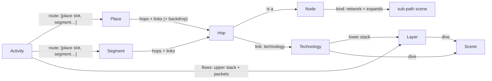

# Architecture

The app is an **engine** (`src/`) that knows nothing about phones, Wi‑Fi or fibre, and **content**
(`content/`) that is discovered by folder with `import.meta.glob`. New devices, technologies, layers, dives, places,
activities, languages and learn-more links are added as folders; no engine code changes. The laptop at the desk
(`content/nodes/laptop/` + `content/places/desk/`) was added that way, in a commit that touches only `content/`.
[authoring.md](authoring.md) walks through each kind of addition.

Stack and look and feel are decided in [visualisation-spikes.md](visualisation-spikes.md) (Svelte 5 + SVG + DOM text)
and [look-and-feel.md](look-and-feel.md) (Storybook, fly zoom, ease).

## The model

A reader is **somewhere** (a *place*: at home, on the street, at the desk…) **doing something** (an *activity*:
watching a video…). Choosing both gives a **route**: a chain of hops (node instances) joined by links (each of one
technology). Every place works with every activity.



| Kind | Folder | Is |
|---|---|---|
| **Node** | `content/nodes/<id>/` | A device or place on the path (phone, router, cell tower, CDN…). `kind` is `device` or `network` (a group, like `internet`, that unfolds into its own path scene). Its default `role` (`endpoint`, `bridge`, `router`, `nat`) decides which layers it opens and what it does to addresses. Art: `art/Device.svelte`. |
| **Technology** | `content/technologies/<id>/` | What a link is made of (Wi‑Fi, Ethernet, GPON, 5G NR…). Its **lower layer stack**, a `look` (`radio`, `cable`, `fibre`, `trunk`: the theme draws each look), a colour, and optionally the **dive** scene that explains it. |
| **Layer** | `content/layers/<id>/` | One envelope in a packet: HTTP, TLS, TCP, IP, Wi‑Fi, Ethernet, GPON, MPLS, VLAN, NR, GTP. Its **header schema** (`fields`: id, bits, value template, which roles use it) drives the packet model and the peek (below). `openAt` lists the roles that read it (TCP: only endpoints), `seals` makes it encrypt what's inside, and `dive` names the layer dive scene behind its magnifier. Issues #5, #8, #17. |
| **Scene** | `content/scenes/<id>/` | A "look inside" dive: `Scene.svelte` plus its own art and maths. It `explains` a **link**: the physical signal (`wifi-radio`, `copper-pulses`, `fibre-light`, `nr-radio`), or a **layer at one hop**: the envelope (`ip-post`, `tcp-pieces`, `tls-lock`, `gtp-tunnel`, and for the link layers `wifi-frame`, `sticker-doors`, `gpon-slots`, `nr-grant`). It gets a `subject` (below), so one scene serves several technologies (the fibre dive draws GPON's two colours on the access fibre and DWDM on metro and backbone fibre), several layers (`sticker-doors` is Ethernet's door book, VLAN's coloured lanes and MPLS's motorway numbers), or every hop (the IP dive is a signpost at a router, a swap notebook at a NAT, carrier-grade NAT at the mobile core). |
| **Segment** | `content/segments/<id>/` | A reusable stretch of route (`isp-to-cdn`: ISP core → IXP → CDN, with transit as a dashed side branch). Hops, links, side branches, per-hop overrides and layout. |
| **Place** | `content/places/<id>/` | A segment that starts at the reader's device and joins the shared network, plus a backdrop (`art/Backdrop.svelte`: the house, the street) and an `order` in the picker. |
| **Activity** | `content/activities/<id>/` | What happens: the **flows** (upper stack `ip › tcp › tls › http`, and packet kinds with direction, pace and colour) and the **route** (`[{ place: 'me' }, { segment: 'isp-to-cdn' }]`), plus which network nodes expand. |
| **Locale** | `content/locales/<lang>/` | `meta.json` (`name`, `dir`) and `ui.json` (chrome strings). Every other folder carries its own `locales/<lang>.json`. |
| **Theme** | `content/themes/<id>/` | The visual style (`?style=<id>`): tokens, motion, sound, and the engine's art slots (below). |

Designed in, but used by only one item so far:
- **Instances.** A hop is `{ at: <instance>, node?: <node> }`, so a route can hold two routers (messaging, later).
- **Several place slots per route.** Messaging would have `me` and `friend`, each optionally restricted with `only`.
- **Several flows per activity.** Each flow has its own upper stack and packet kinds (DNS before the video, a P2P call).
- **Per-link overrides:**
  - `stack` (the gNB → mobile core link adds a `gtp` tunnel; the IXP drops MPLS)
  - `dive` (a different scene, or `false` for none)
  - `role`, `addr` and `natTo` per hop

### How future ideas map onto it

| Idea | What to add |
|---|---|
| Issue #3: xDSL, FTTB, dial-up, cable | For each, one **place** (or a variant of `home`) that uses a new **technology** (`vdsl`, `docsis`, `v90`…) with its own **layer** (e.g. `ppp`) and, if it deserves one, a **scene** (a copper pair with tones, a modem handshake). GPON already exists as a technology, and the fibre dive has a GPON mode. |
| Issue #2: IoT, LoRaWAN | A **node** (`sensor`, `lora-gateway`, `network-server`), a **technology** `lorawan` (look `radio`) with a `lorawan` **layer** and a `chirp` dive **scene**, a **place** (`garden`, `field`), and an **activity** such as `send-reading` with a small upward flow. `only` keeps it to places that make sense. |
| Messaging | An activity with two place slots (`me`, `friend`) around a `messaging-server` segment, and an `e2ee` layer that the server can't open (`openAt: ['endpoint']`). |
| Video call (P2P, WebRTC) | A second flow on a direct path, with the NAT traversal shown on the routers (`role: 'nat'`). |
| Airplane, Starlink | A place `airplane` with the technologies `satellite` and `aircraft-wifi`. Packet pace per link shows the latency. |
| DNS, cache miss, rerouting | A preceding flow (DNS); an `origin` segment behind the CDN; an aside that becomes the path (transit). |

## Folder layout

```
index.html
src/                      the engine: no content ids anywhere
  api.ts                  the only module Svelte content imports ($core/api)
  define.ts               defineNode/defineTechnology/… for definition files ($core/define; types only)
  main.ts App.svelte state.svelte.ts router.ts
  engine/                 camera (semantic zoom), gestures, motion, packets, sound, svg, geometry, zoom
  model/                  registry (content globs), components (Svelte globs), strings, schema + validate (zod),
                          resolve (route), layout (path scenes), tree (scene tree), packet (the packet model),
                          stack (LayerCtx), location (URL)
  render/                 World (camera + recursive scenes), SceneView, PathScene, Node, Depth, Text, TagAt,
                          art-base/ (fallback art slots), theme-types (the theme contract)
  ui/                     Chrome (breadcrumb, language, level, pause, sound), Caption, PeekPanel, Envelope, FieldTree…
content/
  locales/{en,da}/        meta.json ui.json
  themes/storybook/       theme.ts tokens.css meta.json art/*.svelte
  nodes/<id>/             node.ts  art/Device.svelte  locales/<lang>.json
  technologies/<id>/      technology.ts  locales/
  layers/<id>/            layer.ts  locales/
  scenes/<id>/            scene.ts  Scene.svelte  art/  *.ts (scene maths)  locales/
  segments/<id>/          segment.ts  locales/
  places/<id>/            place.ts  art/Backdrop.svelte  locales/
  activities/<id>/        activity.ts  locales/
```

Import rules keep this honest (checked by `src/model/content.test.ts`):
- Content `.ts` files import only `$core/define` (types) and relative files.
- Content `.svelte` files import only `$core/api` and relative files.
- The engine never names a content id.

## From URL to pixels

```
#/<lang>/<place>[+<place>…]/<activity>/<step>/<step>…/@<stop>     ?level=nerd  ?style=<theme>
#/da/street/watch-video/internet/@mobile-core
#/en/home/watch-video/internet/home-cabinet                         (three levels: the access fibre)
#/en/home/watch-video/router~ip                                     (a layer dive: IP at the home router)
#/da/street/watch-video/internet/mobile-core~ip                     (IP at the mobile core: carrier-grade NAT)
```

1. **Location** (`model/location.ts`, `router.ts`). The hash is parsed into `{ lang, places, activity, path, stop }`.
   - Changing a scene or place pushes a history entry, so Back undoes a place switch. Changing the stop or the language replaces the entry.
   - A path that no longer exists falls back to its longest valid prefix. For example, after switching to the street, the Wi‑Fi dive becomes the overview, and `internet/home-cabinet` becomes `internet`. A layer dive survives a place switch when its hop is in both routes (`phone~tcp`); `router~ip` on the street becomes the overview.
2. **Route** (`model/resolve.ts`). The activity's route steps are filled with the chosen places and segments and joined into one chain of hops and links. Each hop gets its node, role, address and group. Each link gets its technology, stack, dive and colour. The route also records which folder each part came from, so strings can be looked up from the most specific source.
3. **Path scenes** (`model/layout.ts`). The root scene shows the hops outside any group, and each group collapses into one node. Expanding a group shows the hops inside it, with an *entry* node that stands for "where you came from" (the house, or the cell tower).
   - Placement comes from the place, segment and activity `layout`, per orientation. Unplaced nodes are spread along the spine.
   - Links are routed from their end nodes, with a `bend` or a hand-drawn `curve`.
4. **Scene tree** (`model/tree.ts`).
   - A path scene's children, in route order, are its expandable groups, its links that have a dive, and its **layer dives**: for every hop drawn in the scene (not groups, entries or asides), every layer with a `dive` on the links arriving at it. The step is `<hop>~<layer>`.
   - A layer dive's subject is that hop's `LayerCtx`, in a canonical direction (the way the layer arrives upwards if it does, else downwards: the NAT sees the request go out, the phone the video come in), so the URL needs no direction. The scenes show the round trip anyway.
   - A child sits at `DETAIL_SCALE` inside its anchor (the node, or the link's midpoint), to any depth. A hop's layer panels form a **vertical stack** centred on the node, lower layers below, so stepping between them is a flight up or down.
   - `layerPath(route, hop, layer)` finds the scene in which a hop is drawn, so tapping IP in the peek at the root, for a packet at the cabinet, flies to `internet/cabinet~ip`.
   - **All the way down (issue #13).** Every link has a dive (its signal) and so does every layer in its lower stack
     (its envelope); a content test checks this for every place × activity. `downFrom(route, ref)` goes from a link
     layer's dive to its link's dive (next to it when that scene draws the link: `internet/cabinet~gpon` →
     `internet/home-cabinet`); `upFrom(route, ref)` goes from a link dive to the dives of its link's layers (at the end
     drawn beside it, else the one receiving them going up); `linkOut` is the link a caught packet's outer envelopes
     belong to. They become the caption's **How it travels** / **What it carries** chips and the peek's bottom row.
   - Each mounted scene gets one flat transform from the root, computed in JS doubles, so three levels deep (1000×) stays sharp. Only the scenes along the flight and their near children are mounted.
5. **Camera** (`engine/camera.ts`, `engine/zoom.ts`). Fly zoom and semantic zoom (pinch or scroll into a child and it opens; out, and it closes) work on the current scene, its parent and its children, never on hard-coded ids.
   - Layer dives are only reached by address (the peek, the URL, stepping), never discovered by pinching into a node: `mixes` and `decide` skip layer children that aren't on the current path, so pinching into a router still does what it did.
   - Sideways stepping (`sideways` in `model/tree.ts`) walks the stops of a path scene, the sibling link dives in route order (Wi‑Fi ↔ copper ↔ fibre at home; 5G ↔ fibre on the street), or, in a layer dive, the layers of the same hop in stack order (▲/▼, a vertical flick, the arrow keys).
   - **Into a layer dive from the peek:** the tapped envelope's rect is noted, the catch is let go and the normal fly zoom starts; a DOM clone of the envelope is moved each frame from its peek rect to the dive panel's current on-screen rect, landing on it as the panel fades in (none with `prefers-reduced-motion`).
6. **Packets** (`engine/packets.ts`). Each flow's packets run along every link of the scene at a per-link pace. Tapping one **catches** it (below).
7. **Doors** (`model/doors.ts`, below). What a path scene lets you open, drawn by the theme's `Hint`, hit-tested in `App.svelte` and listed in the caption.

### Pause, catch and step (issue #17)

Navigating the scene shows a packet's physical life; catching one shows its layers.
- **Pause** (⏸ in the top bar next to "Explore", path scenes only) freezes the traffic clock; dives keep animating. Tapping a packet,
  moving or frozen, catches it and pauses if needed (letting it go resumes only if the catch paused).
- The caught packet is drawn as a ghost (`poseOn`) waiting at a **chain hop**: just before it, on the link it arrives
  by (`caughtSpot`). A packet caught between hops waits at the hop ahead, or the one behind when the scene doesn't
  draw the hop ahead (a collapsed group): `hopAhead`. Its live twin is hidden while caught.
- **Step** (◀ ▶ in the panel, the arrow keys, a flick) moves it one hop along its path (`stepHop`), gliding along the
  link. When the next hop is drawn in another scene (`hopScenePath`: into the internet, back out to the house), the
  camera flies there. The camera tracks the ghost until the user pans or zooms.

### The packet model (`model/packet.ts`)

Every header field of every layer has a real example value on every link, **derived** from content, not written per
hop. A layer's `fields` hold value templates with facts from the route:

| Fact | On a link, in the packet's direction |
|---|---|
| `{src}` `{dst}` `{sport}` `{dport}` | The client's address and port after every NAT passed (`natTo: 'addr:port'` on a hop), the server's from its `addr` and the flow's `ports` |
| `{ttl}` | 64 at the sender, minus one per `router` or `nat` passed |
| `{mac.src}` `{mac.dst}` | The nearest L2 ends: the hops either side that aren't bridges (a bridge passes the frame on) or where a tunnel starts or ends |
| `{mac.tx}` `{mac.rx}` | The link's own two ends (radio transmitter and receiver) |
| `{tunnel.src}` `{tunnel.dst}` | The ends of the run of links carrying the `tunnel` layer |
| `{len}` `{payload}` (`{payload+8}`) | This layer and all inside it / only what's inside, in bytes (from `bits` and `bytes`) |
| `{sum}` `{crc}` | Stable fake checksums that change whenever what they cover changes |
| `{inner.<code>}` | How this layer names the next one inside (`code` on that layer: EtherType, IP protocol) |

`packetOn(route, flow, link, dir)` resolves the stack on one link, inside-out (lengths and checksums cover inner
layers). Values carry who they belong to (`who`: a hop), so kids see "your phone" where nerds see `192.168.1.23`.

`hopView(route, flow, dir, hop)` compares the packet as received and as sent at a hop (the two stacks aligned, so
layers are **kept**, **added** or **removed**, like a tunnel or a new link frame). For each layer:
- **sealed**: inside a `seals` layer (TLS) this hop doesn't open
- **closed**: not in the layer's `openAt` for this hop's role (TCP at a router): readable, not its business
- **open**: everything else

Each field is **used** when the hop's role is in its `use` (or `use: true`), and **changed** (with the value `before`)
when a kept layer's value differs. So the home router shows: Ethernet off, GPON on, TTL 64 → 63, source address and
port rewritten, checksums fixed; the cell tower: NR off, Ethernet and a GTP‑U tunnel on.

### The peek (`ui/PeekPanel.svelte`)

The hop's name and "3 of 9", what it does (`node.<id>.peek.<dir>`, else `peek.role.<role>`), chips for what changed,
the envelopes taken off here, then the packet as it leaves as nested envelopes (`ui/Envelope.svelte`), and below them
**How it travels: Light in a glass thread**, down to the dive of the link it leaves on (at its last hop, the one it
arrived on; the catch is let go and the camera flies there). Kids see only
fields with a `kid` value that matter here (used, changed, or new); nerds see every field and who owns each address.
**Details** swaps in a protocol tree (`ui/FieldTree.svelte`): a Wireshark-style summary line per layer
(`layer.<id>.line`), its note, an RFC-style header diagram (32 bits a row, when every field has `bits`), and every
field with its value, size and what it's for. No bytes.
While a packet is caught, the caption and the breadcrumb step aside: the panel's header ("Caught: a piece of video")
says what you're looking at. Both come back when it's let go.

### Doors: what you can open (issue #19)

Everything a reader can open from a path scene is a **door**, with one verb each, used the same way in the scene, the
caption and the strings (`door.*`):

| Verb | Kind | On | Opens | Mark (Storybook) |
|---|---|---|---|---|
| **Look inside** | `dive` | a link with a dive | the link's dive scene | teal round lens with a magnifier, pulsing |
| **Open up** | `expand` | a group node (`kind: network`) | its own path scene | orange lens with a door (its label shows when pointed at or lit); a breathing dashed ring round the group |
| **Change** | `swap` | the start device (root only) | the place / activity picker | berry rounded square with arrows |

A fourth verb, **Catch**, is for packets (issue #17, above): the caption lists the flow's packet kinds ("Catch: Request ·
Video") and a chip catches the youngest packet of that kind on screen.

Dives have two more, caption chips only (issue #13), joining an envelope and the signal that carries it:

| Verb | Kind | In | Opens |
|---|---|---|---|
| **How it travels** (wave icon) | `down` | a link layer's dive (Wi‑Fi, Ethernet, GPON, NR, VLAN, MPLS, GTP) | its link's dive, named by that scene's title ("Electricity in copper") |
| **What it carries** (envelope icon) | `up` | a link's dive | the dive of each layer in the link's stack ("Radio envelope") |

They are found by `downFrom`/`upFrom` (above), so they appear by themselves when a technology or a link layer gets a
dive; `CaptionDoor.path` carries where they go.

- `doorsOf(pathScene, root)` lists them (the swap first, then in route order). They are exactly the scene tree's
  dive and group children (a test checks this for every place × activity), so a door can't point nowhere.
- `layoutDoors` places the badges: a mark at the door's spot; labelled (always for *Open up*, for every door while
  "What can I explore?" is on, and for the one pointed at) a pill that runs on from the mark. While lit, pills that
  would cover each other are nudged apart. The same layout is used to draw and to hit-test, so a badge is always where
  its tap target is. A tap right on a badge beats a packet passing under it.
- **Hover and focus.** With a mouse, the door under the pointer glows and shows its label (and the cursor becomes a
  pointer over anything tappable). Pointing at or focusing a caption chip lights its badge in the scene the same way.
- **"What can I explore?"** (the ✨ button in the chrome) lights every door of the current scene with its label for
  six seconds, or until tapped again, a tap on the scene or a scene change. If some are off screen (zoomed in on a
  stop), it steps back to the whole scene first. It's disabled where a scene has no doors (dives).
- **Caption chips.** The caption lists the doors by verb ("Look inside: Wi‑Fi · Fibre   Open up: The internet"; at a
  stop, only that stop's own). Links of the same technology share one chip (the first) at scene level; walking to a
  stop gives each its own. They are real buttons, so they are the keyboard and screen-reader way in (the scene
  SVG is `aria-hidden`). On small screens only the verb's icon is shown; the group keeps the verb as its label.
- **Motion.** The breathing, pulsing and bobbing stop with `prefers-reduced-motion` (`view.still`).

### The place morph

Picking another place in the picker (the swap badge on the start device, or "Change" in the caption) re-resolves the route. Then, over about 750 ms:
- Nodes that are in both routes glide to their new spots.
- Nodes that are only in the old route shrink away, and new ones pop in.
- The links follow their nodes.
- The place backdrops slide past each other (the house out, the street in).

Packets restart on the new route, and the caption waits for the morph to finish.

## The context that content gets

**Dive scenes** (`Scene.svelte`) get `{ subject }`, a `LinkSubject` or a `LayerSubject` (`subject.kind`):
- link dives: `subject.link` (the route link it explains, with `tech`, `stack`, and the `from`/`to` hops),
  `subject.sceneLink` (the link as drawn in the parent) and `subject.route` (the whole route);
- layer dives: `subject.layer`, `subject.ctx` (the hop's `LayerCtx`, below, at the current level), `subject.open`
  (whether the hop reads the layer, else it's sealed there) and `subject.route`. Captions look up
  `scene.<id>.at.<node>`, then `.role.<role>`, then `.sealed`, then the plain strings; each first under the layer
  (`scene.<id>.<layer>.at.<node>` … `scene.<id>.<layer>`), for a scene serving several layers.

Dive scenes load on demand (`render/dives.svelte.ts`): a scene's chunk is fetched when the flight towards it starts,
and the peek preloads the layer dives it offers.

From `$core/api` they read `view` (time, orientation, level), `strings('scene.<id>')`, and draw with `Node` (a device in the current theme), `Text` (screen-size-aware text) and `TagAt`.

**Layer dives** get a `LayerCtx` (`model/stack.ts`, built on the packet model), per hop and direction:

```ts
{ flow, kind, dir: 'up' | 'down', link, from, to, role /* of `to`, the reader */, client, server,
  src, dst, sport, dport /* as seen on this link, after any NAT */,
  nat: { inside, outside, insidePort, outsidePort } | null, ttl, level }
```

The stack on a link is `link.stack ?? tech.stack` (outermost first), followed by `flow.stack`. Examples:

| Link | Frames |
|---|---|
| phone → AP | Wi‑Fi |
| AP → router | Ethernet |
| router → cabinet | GPON (the router NATs 192.168.1.23:51034 → 203.0.113.7:61757) |
| cabinet → backhaul → BNG | Ethernet + VLAN |
| core | Ethernet + MPLS |
| across the IXP | Ethernet |
| phone → cell tower | 5G NR |
| cell tower → mobile core | Ethernet + GTP‑U (the mobile core does carrier-grade NAT 100.64.12.7:51034 → 192.0.2.44:20517) |

TCP, TLS and HTTP are sealed everywhere but the two ends. The IP layer shows the rewrite at each NAT.

**Node art** (`art/Device.svelte`) draws a body in a 200 × 200 box using the theme's vocabulary classes (`body`, `peach`, `screen`, `hi`, `button`…). It exports `face = [x, y]` where a theme may put a face.

**Place backdrops** get `{ orient, w, h, time }` and draw in root-scene coordinates. They may wrap parts in `<Depth d>` for parallax.

## Plug-in points (engine side)

| Point | Where | What plugs in |
|---|---|---|
| Content data | `model/registry.ts` | `content/<kind>/<id>/<kind>.ts` (node.ts, technology.ts, …) |
| Svelte content | `model/components.ts` | node art, layer envelopes, dive scenes, place backdrops |
| Strings | `model/strings.ts` + the `string-packs` plugin in `vite.config.ts` | `content/**/locales/<lang>.json`, auto-namespaced by folder (`node.phone.name`, `place.home.stop.router.kid`) |
| Themes | `state.svelte.ts` (`loadTheme`) | `content/themes/<id>/`, with unset slots falling back to `render/art-base/` |
| Validation | `model/validate.ts` | runs every schema and cross-reference; dev + tests only |

**The theme contract** (`render/theme-types.ts`) has only engine-level slots: `Defs`, `Backdrop` (sky and hills),
`Device` (places the node art, adds a face and a focus ring, and a fallback body), `Link` (by `look`), `Packet`, `Hint` (a door: `dive`, `expand`, `swap`, drawn in two parts, a
`glow` round what it opens under the devices and a `badge` over everything, with its label, `hot` and the reduced-motion
clock), `Tag`, `Label`, `Panel` and `Overlay`. `Panel` gets a `kind` (`path`, `dive`, `layer`) and
`sealed`: Storybook draws a layer dive as a big envelope with its flap at the top, dashed when sealed. Scene-specific art (waves, prisms, beams) lives
in the scene's own folder, so a new dive needs no theme change.

## Strings and languages

- **Namespacing.** Each folder's `locales/<lang>.json` is namespaced by kind and id (`nodes/phone` → `node.phone.*`).
- **Levels.** Any key may be a string or `{ "kid": …, "nerd": … }`. A level-aware lookup falls back from `key.<level>` to `key`.
- **Lookup order.** Captions look up text from the most specific source to the least:
  1. the places and segments on the route (`place.home.stop.router`)
  2. the activity
  3. the item itself (`node.router`)
- **English fallback.** Any missing string falls back to English. `npm run check:content` prints translation coverage.
- **Bundling.** English ships in the main bundle, except the dive strings (the layers': header field names and meanings; the dive scenes': their captions and labels): they load as one chunk (`virtual:dive-strings`) on the first catch, on entering any dive, or at start for a link below the overview (`loadDiveStrings`; text asked for them earlier updates when they arrive). Other languages load on first use, one chunk each (about 6 kB gz for da), via the `virtual:string-packs` plugin in `vite.config.ts`. Adding a language therefore costs nothing for readers who don't pick it.
- **Languages.** English and Danish, the languages we can review ourselves (issue #11).
- **RTL.** A language's `meta.json` sets `dir`, which `setLang` puts on `<html>`: the chrome mirrors (logical CSS properties), the diagrams don't. No shipped language is right-to-left, so `src/rtl.test.ts` keeps the support working with a made-up test-only language. A reviewed RTL language comes back as content only: its locale folder, plus faces for its script in the theme's `tokens.css`.

## Learn more (issue #4)

Every definition may list `learnMore: [{ url, title, level: 'kid' | 'nerd' | 'both', lang }]`. The caption shows up to
three links for the focused item:
- links for the reader's level, in the reader's language first
- English nerd links always stay, and are marked "(en)" for a non-English reader
- other English links appear only when there is nothing in the reader's language

## Validation and tests

`model/schema.ts` (zod) is the single source of truth for the content types. `define.ts` only imports its types, so
zod never reaches the production bundle.

`model/validate.ts` checks:
- every definition against its schema
- every cross-reference (with "did you mean")
- that hops and links alternate
- that every place × activity combination forms a well-formed chain ending at a server
- that layouts only name real instances
- that the required English strings exist
- that learn-more languages exist
- that each scene folder has its component
- layer header fields: unique ids, a name string per field (kid and nerd), known facts in value templates (with "did
  you mean"), `{inner.<code>}` codes that some layer declares, `@key` values that have a string
- that technology and link dives point at link scenes, and layer dives at layer scenes

In dev, problems go to the console and the Vite overlay:

```
content/places/street/place.ts › hops[1].link: "nr5g" is not a technology. Did you mean "nr"? Known: backbone, ethernet, gpon, …
```

Vitest (`npm test`) covers:
- that the real content validates
- negative fixtures
- route resolution for every place
- the scene tree and stale-path fallback, layer children per hop, stacked frames, `layerPath` and sideways stepping
- doors: the list per scene (matching the scene tree's children everywhere), badge spots, none while fading in a
  place switch, which are on screen, and the badge layout (labels, nudging lit labels apart)
- layer dives: schema and validation (`dive` must point at a layer scene), URL round trip, never picked up by pinch
- the layer stacks, roles, NAT/CGNAT and GTP per hop
- the packet model: every value on every link resolves; NAT and CGNAT rewrites, the TTL count-down, MAC continuity
  across bridges, GTP tunnel ends and TEIDs, lengths; each hop's received → used/changed → sent shape (AP, home
  router, core, tower, mobile core, both ends); catching and stepping (`hopAhead`, `stepHop`, `caughtSpot`,
  `hopScenePath`)
- the URL round trip
- string fallback and lazy language packs
- the import rules

CI runs `npm ci && npm test && npm run build`.

## Performance

`npm run evaluate` (see [app-metrics.json](app-metrics.json)) measures a portrait phone viewport (390 × 844 @2×) at
1× and 6× CPU throttle. It covers:
- idle, the fly into the fibre and back out
- the fly three levels down, then catching a packet and stepping it two hops
- the morph to the street, the fly into 5G, and the 5G dive idle
- the fly down to the copper cable (#18), its idle, and a link-layer dive's idle (the Wi‑Fi envelope, #13)
- opening a layer dive from the peek (the envelope grows into the scene), its idle, a sideways step to the next
  layer, and that layer's idle

Every phase keeps p95 ≤ 16.8 ms (one frame at 60 Hz) at 6×, and CPU per frame is at most about 12 ms (the flies into
5G and down to copper, and opening a layer dive; it varies a few ms between runs). Animated scenes avoid group
`opacity` and animated `stroke-dashoffset` on long paths: both made the copper cable miss frames at 6×. Door labels are measured once per language and theme, not per zoom step
(measuring text every frame of a flight cost more than the doors themselves).

Initial JS is 68.6 kB gz (64.1 kB before the doors of issue #19 and the stack view of #17), against 60.9 kB for the
prototype. Dive scenes are lazy chunks (2–7 kB gz each), so adding dives doesn't grow the first load; so are the
peek panel (with its envelopes and protocol tree, about 4.8 kB) and the English dive strings (the layers' and the
dive scenes', about 14.6 kB), which load on the first catch or dive.
