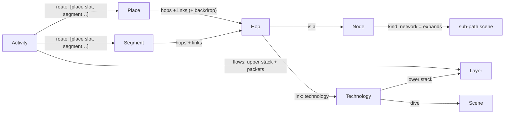

# Architecture

The app is an **engine** (`src/`) that knows nothing about phones, Wi‑Fi or fibre, and **content**
(`content/`) that is discovered by folder with `import.meta.glob`. New devices, technologies, layers, dives, places,
activities, languages and learn-more links are added as folders; no engine code changes. The laptop at the desk
(`content/nodes/laptop/` + `content/places/desk/`) was added that way, in a commit that touches only `content/`.
[authoring.md](authoring.md) walks through each kind of addition.

Stack and look and feel are decided in [visualisation-spikes.md](visualisation-spikes.md) (Svelte 5 + SVG + DOM text)
and [look-and-feel.md](look-and-feel.md) (Storybook, fly zoom, ease).

## The model

A reader is **somewhere** (a *place*: at home, on the street, at the desk…) **doing something** (an *activity*:
watching a video…). Choosing both gives a **route**: a chain of hops (node instances) joined by links (each of one
technology). Every place works with every activity.



| Kind | Folder | Is |
|---|---|---|
| **Node** | `content/nodes/<id>/` | A device or place on the path (phone, router, cell tower, CDN…). `kind` is `device` or `network` (a group, like `internet`, that unfolds into its own path scene). Its default `role` (`endpoint`, `bridge`, `router`, `nat`) decides which layers it opens and what it does to addresses. Art: `art/Device.svelte`. |
| **Technology** | `content/technologies/<id>/` | What a link is made of (Wi‑Fi, Ethernet, GPON, 5G NR…). Its **lower layer stack**, a `look` (`radio`, `cable`, `fibre`, `trunk`: the theme draws each look), a colour, and optionally the **dive** scene that explains it. |
| **Layer** | `content/layers/<id>/` | One envelope in a packet: HTTP, TLS, TCP, IP, Wi‑Fi, Ethernet, GPON, MPLS, VLAN, NR, GTP. `openAt` lists the roles that read it (TCP: only endpoints); `Layer.svelte` draws it in the peek panel from a `LayerCtx` (below). Issue #5. |
| **Scene** | `content/scenes/<id>/` | A "look inside" dive (`wifi-radio`, `fibre-light`, `nr-radio`): `Scene.svelte` plus its own art and maths. It gets a `subject` (the link it explains), so one scene serves several technologies (the fibre dive draws GPON's two colours on the access fibre and DWDM elsewhere). |
| **Segment** | `content/segments/<id>/` | A reusable stretch of route (`isp-to-cdn`: ISP core → IXP → CDN, with transit as a dashed side branch). Hops, links, side branches, per-hop overrides and layout. |
| **Place** | `content/places/<id>/` | A segment that starts at the reader's device and joins the shared network, plus a backdrop (`art/Backdrop.svelte`: the house, the street) and an `order` in the picker. |
| **Activity** | `content/activities/<id>/` | What happens: the **flows** (upper stack `ip › tcp › tls › http`, and packet kinds with direction, pace and colour) and the **route** (`[{ place: 'me' }, { segment: 'isp-to-cdn' }]`), plus which network nodes expand. |
| **Locale** | `content/locales/<lang>/` | `meta.json` (`name`, `dir`) and `ui.json` (chrome strings). Every other folder carries its own `locales/<lang>.json`. |
| **Theme** | `content/themes/<id>/` | The visual style (`?style=<id>`): tokens, motion, sound, and the engine's art slots (below). |

Designed in, but used by only one item so far:
- **Instances.** A hop is `{ at: <instance>, node?: <node> }`, so a route can hold two routers (messaging, later).
- **Several place slots per route.** Messaging would have `me` and `friend`, each optionally restricted with `only`.
- **Several flows per activity.** Each flow has its own upper stack and packet kinds (DNS before the video, a P2P call).
- **Per-link overrides:**
  - `stack` (the gNB → mobile core link adds a `gtp` tunnel; the IXP drops MPLS)
  - `dive` (a different scene, or `false` for none)
  - `role`, `addr` and `natTo` per hop

### How future ideas map onto it

| Idea | What to add |
|---|---|
| Issue #3: xDSL, FTTB, dial-up, cable | For each, one **place** (or a variant of `home`) that uses a new **technology** (`vdsl`, `docsis`, `v90`…) with its own **layer** (e.g. `ppp`) and, if it deserves one, a **scene** (a copper pair with tones, a modem handshake). GPON already exists as a technology, and the fibre dive has a GPON mode. |
| Issue #2: IoT, LoRaWAN | A **node** (`sensor`, `lora-gateway`, `network-server`), a **technology** `lorawan` (look `radio`) with a `lorawan` **layer** and a `chirp` dive **scene**, a **place** (`garden`, `field`), and an **activity** such as `send-reading` with a small upward flow. `only` keeps it to places that make sense. |
| Messaging | An activity with two place slots (`me`, `friend`) around a `messaging-server` segment, and an `e2ee` layer that the server can't open (`openAt: ['endpoint']`). |
| Video call (P2P, WebRTC) | A second flow on a direct path, with the NAT traversal shown on the routers (`role: 'nat'`). |
| Airplane, Starlink | A place `airplane` with the technologies `satellite` and `aircraft-wifi`. Packet pace per link shows the latency. |
| DNS, cache miss, rerouting | A preceding flow (DNS); an `origin` segment behind the CDN; an aside that becomes the path (transit). |

## Folder layout

```
index.html
src/                      the engine: no content ids anywhere
  api.ts                  the only module Svelte content imports ($core/api)
  define.ts               defineNode/defineTechnology/… for definition files ($core/define; types only)
  main.ts App.svelte state.svelte.ts router.ts
  engine/                 camera (semantic zoom), gestures, motion, packets, sound, svg, geometry, zoom
  model/                  registry (content globs), components (Svelte globs), strings, schema + validate (zod),
                          resolve (route), layout (path scenes), tree (scene tree), stack (LayerCtx), location (URL)
  render/                 World (camera + recursive scenes), SceneView, PathScene, Node, Depth, Text, TagAt,
                          art-base/ (fallback art slots), theme-types (the theme contract)
  ui/                     Chrome (breadcrumb, language, level, sound), Caption, PeekPanel, PlacePicker, Envelope…
content/
  locales/{en,da,ar}/     meta.json ui.json
  themes/storybook/       theme.ts tokens.css meta.json art/*.svelte
  nodes/<id>/             node.ts  art/Device.svelte  locales/<lang>.json
  technologies/<id>/      technology.ts  locales/
  layers/<id>/            layer.ts  Layer.svelte  locales/
  scenes/<id>/            scene.ts  Scene.svelte  art/  *.ts (scene maths)  locales/
  segments/<id>/          segment.ts  locales/
  places/<id>/            place.ts  art/Backdrop.svelte  locales/
  activities/<id>/        activity.ts  locales/
```

Import rules keep this honest (checked by `src/model/content.test.ts`):
- Content `.ts` files import only `$core/define` (types) and relative files.
- Content `.svelte` files import only `$core/api` and relative files.
- The engine never names a content id.

## From URL to pixels

```
#/<lang>/<place>[+<place>…]/<activity>/<step>/<step>…/@<stop>     ?level=nerd  ?style=<theme>
#/da/street/watch-video/internet/@mobile-core
#/en/home/watch-video/internet/home-cabinet                         (three levels: the access fibre)
```

1. **Location** (`model/location.ts`, `router.ts`). The hash is parsed into `{ lang, places, activity, path, stop }`.
   - Changing a scene or place pushes a history entry, so Back undoes a place switch. Changing the stop or the language replaces the entry.
   - A path that no longer exists falls back to its longest valid prefix. For example, after switching to the street, the Wi‑Fi dive becomes the overview, and `internet/home-cabinet` becomes `internet`.
2. **Route** (`model/resolve.ts`). The activity's route steps are filled with the chosen places and segments and joined into one chain of hops and links. Each hop gets its node, role, address and group. Each link gets its technology, stack, dive and colour. The route also records which folder each part came from, so strings can be looked up from the most specific source.
3. **Path scenes** (`model/layout.ts`). The root scene shows the hops outside any group, and each group collapses into one node. Expanding a group shows the hops inside it, with an *entry* node that stands for "where you came from" (the house, or the cell tower).
   - Placement comes from the place, segment and activity `layout`, per orientation. Unplaced nodes are spread along the spine.
   - Links are routed from their end nodes, with a `bend` or a hand-drawn `curve`.
4. **Scene tree** (`model/tree.ts`).
   - A path scene's children, in route order, are its expandable groups and its links that have a dive.
   - A child sits at `DETAIL_SCALE` inside its anchor (the node, or the link's midpoint), to any depth.
   - Each mounted scene gets one flat transform from the root, computed in JS doubles, so three levels deep (1000×) stays sharp. Only the scenes along the flight and their near children are mounted.
5. **Camera** (`engine/camera.ts`, `engine/zoom.ts`). Fly zoom and semantic zoom (pinch or scroll into a child and it opens; out, and it closes) work on the current scene, its parent and its children, never on hard-coded ids.
   - Sideways stepping walks the stops of a path scene, or the sibling dives in route order (Wi‑Fi ↔ fibre at home; 5G ↔ fibre on the street).
6. **Packets** (`engine/packets.ts`). Each flow's packets run along every link of the scene at a per-link pace. Tapping one follows it, and the peek panel shows its layers at the current hop.

### The place morph

Picking another place in the picker (the swap badge on the start device, or "Change" in the caption) re-resolves the route. Then, over about 750 ms:
- Nodes that are in both routes glide to their new spots.
- Nodes that are only in the old route shrink away, and new ones pop in.
- The links follow their nodes.
- The place backdrops slide past each other (the house out, the street in).

Packets restart on the new route, and the caption waits for the morph to finish.

## The context that content gets

**Dive scenes** (`Scene.svelte`) get `{ subject }`:
- `subject.link`: the route link it explains, with `tech`, `stack`, and the `from`/`to` hops.
- `subject.sceneLink`: the link as drawn in the parent.
- `subject.route`: the whole route.

From `$core/api` they read `view` (time, orientation, level), `strings('scene.<id>')`, and draw with `Node` (a device in the current theme), `Text` (screen-size-aware text) and `TagAt`.

**Layer envelopes** (`Layer.svelte`) get `{ ctx, open, depth, children }`. `ctx` is a `LayerCtx` from `model/stack.ts`, computed per hop and direction:

```ts
{ flow, kind, dir: 'up' | 'down', link, from, to, role /* of `to`, the reader */, client, server,
  src, dst /* addresses as seen on this link, after any NAT */, nat: { inside, outside } | null, ttl, level }
```

The stack on a link is `link.stack ?? tech.stack` (outermost first), followed by `flow.stack`. A layer is **open** when the reader's role is in its `openAt`, otherwise it is drawn sealed. Examples:

| Link | Frames |
|---|---|
| phone → AP | Wi‑Fi |
| AP → router | Ethernet |
| router → cabinet | GPON (the router NATs 192.168.1.23 → 203.0.113.7) |
| cabinet → backhaul → BNG | Ethernet + VLAN |
| core | Ethernet + MPLS |
| across the IXP | Ethernet |
| phone → cell tower | 5G NR |
| cell tower → mobile core | Ethernet + GTP‑U (the mobile core does carrier-grade NAT 100.64.12.7 → 192.0.2.44) |

TCP, TLS and HTTP are sealed everywhere but the two ends. The IP layer shows the rewrite at each NAT.

**Node art** (`art/Device.svelte`) draws a body in a 200 × 200 box using the theme's vocabulary classes (`body`, `peach`, `screen`, `hi`, `button`…). It exports `face = [x, y]` where a theme may put a face.

**Place backdrops** get `{ orient, w, h, time }` and draw in root-scene coordinates. They may wrap parts in `<Depth d>` for parallax.

## Plug-in points (engine side)

| Point | Where | What plugs in |
|---|---|---|
| Content data | `model/registry.ts` | `content/<kind>/<id>/<kind>.ts` (node.ts, technology.ts, …) |
| Svelte content | `model/components.ts` | node art, layer envelopes, dive scenes, place backdrops |
| Strings | `model/strings.ts` + the `string-packs` plugin in `vite.config.ts` | `content/**/locales/<lang>.json`, auto-namespaced by folder (`node.phone.name`, `place.home.stop.router.kid`) |
| Themes | `state.svelte.ts` (`loadTheme`) | `content/themes/<id>/`, with unset slots falling back to `render/art-base/` |
| Validation | `model/validate.ts` | runs every schema and cross-reference; dev + tests only |

**The theme contract** (`render/theme-types.ts`) has only engine-level slots: `Defs`, `Backdrop` (sky and hills),
`Device` (places the node art, adds a face and a focus ring, and a fallback body), `Link` (by `look`), `Packet`, `Hint`
(`dive`, `expand`, `swap`), `Tag`, `Label`, `Panel` and `Overlay`. Scene-specific art (waves, prisms, beams) lives
in the scene's own folder, so a new dive needs no theme change.

## Strings and languages

- **Namespacing.** Each folder's `locales/<lang>.json` is namespaced by kind and id (`nodes/phone` → `node.phone.*`).
- **Levels.** Any key may be a string or `{ "kid": …, "nerd": … }`. A level-aware lookup falls back from `key.<level>` to `key`.
- **Lookup order.** Captions look up text from the most specific source to the least:
  1. the places and segments on the route (`place.home.stop.router`)
  2. the activity
  3. the item itself (`node.router`)
- **English fallback.** Any missing string falls back to English. `npm run check:content` prints translation coverage.
- **Bundling.** English ships in the main bundle. Other languages load on first use, one chunk each (about 6 kB gz for da), via the `virtual:string-packs` plugin in `vite.config.ts`. Adding a language therefore costs nothing for readers who don't pick it.
- **RTL.** Arabic is the right-to-left test pack.

## Learn more (issue #4)

Every definition may list `learnMore: [{ url, title, level: 'kid' | 'nerd' | 'both', lang }]`. The caption shows up to
three links for the focused item:
- links for the reader's level, in the reader's language first
- English nerd links always stay, and are marked "(en)" for a non-English reader
- other English links appear only when there is nothing in the reader's language

## Validation and tests

`model/schema.ts` (zod) is the single source of truth for the content types. `define.ts` only imports its types, so
zod never reaches the production bundle.

`model/validate.ts` checks:
- every definition against its schema
- every cross-reference (with "did you mean")
- that hops and links alternate
- that every place × activity combination forms a well-formed chain ending at a server
- that layouts only name real instances
- that the required English strings exist
- that learn-more languages exist
- that each layer and scene folder has its component

In dev, problems go to the console and the Vite overlay:

```
content/places/street/place.ts › hops[1].link: "nr5g" is not a technology. Did you mean "nr"? Known: backbone, ethernet, gpon, …
```

Vitest (`npm test`) covers:
- that the real content validates
- negative fixtures
- route resolution for every place
- the scene tree and stale-path fallback
- the layer stacks, roles, NAT/CGNAT and GTP per hop
- the URL round trip
- string fallback and lazy language packs
- the import rules

CI runs `npm ci && npm test && npm run build`.

## Performance

`npm run evaluate` (see [app-metrics.json](app-metrics.json)) measures a portrait phone viewport (390 × 844 @2×) at
1× and 6× CPU throttle. It covers:
- idle, the fly into the fibre and back out
- the fly three levels down and follow
- the morph to the street, the fly into 5G, and the 5G dive idle

Every phase keeps p95 ≤ 16.8 ms (one frame at 60 Hz) at 6×, and CPU per frame is at most about 9 ms.

Initial JS is 64.0 kB gz, against 60.9 kB for the prototype.
