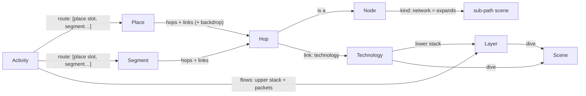

# Architecture

The app is an **engine** (`src/`) that knows nothing about phones, Wi‑Fi or fibre, and **content**
(`content/`) that is discovered by folder with `import.meta.glob`. New devices, technologies, layers, dives, places,
activities, languages and learn-more links are added as folders; no engine code changes. The laptop at the desk
(`content/nodes/laptop/` + `content/places/desk/`) was added that way, in a commit that touches only `content/`.
[authoring.md](authoring.md) walks through each kind of addition.

Stack and look and feel are decided in [visualisation-spikes.md](visualisation-spikes.md) (Svelte 5 + SVG + DOM text)
and [look-and-feel.md](look-and-feel.md) (Storybook, fly zoom, ease).

## The model

A reader is **somewhere** (a *place*: at home, on the street, at the desk…) **doing something** (an *activity*:
watching a video…). Choosing both gives a **route**: a chain of hops (node instances) joined by links (each of one
technology). Every place works with every activity.



| Kind | Folder | Is |
|---|---|---|
| **Node** | `content/nodes/<id>/` | A device or place on the path (phone, router, cell tower, CDN…). `kind` is `device` or `network` (a group, like `internet`, that unfolds into its own path scene). Its default `role` (`endpoint`, `bridge`, `router`, `nat`) decides which layers it opens and what it does to addresses. Art: `art/Device.svelte`. |
| **Technology** | `content/technologies/<id>/` | What a link is made of (Wi‑Fi, Ethernet, GPON, 5G NR…). Its **lower layer stack**, a `look` (`radio`, `cable`, `fibre`, `trunk`: the theme draws each look), a colour, and optionally the **dive** scene that explains it. |
| **Layer** | `content/layers/<id>/` | One envelope in a packet: HTTP, TLS, TCP, IP, Wi‑Fi, Ethernet, GPON, MPLS, VLAN, NR, GTP. Its **header schema** (`fields`: id, bits, value template, which roles use it) drives the packet model and the peek (below). `openAt` lists the roles that read it (TCP: only endpoints), `seals` makes it encrypt what's inside, and `dive` names the layer dive scene behind its magnifier. Issues #5, #8, #17. |
| **Scene** | `content/scenes/<id>/` | A "look inside" dive: `Scene.svelte` plus its own art and maths. It `explains` a **link**: the physical signal (`wifi-radio`, `copper-pulses`, `fibre-light`, `nr-radio`), a **device** (`node`, issue #9): what's inside it and how it turns one medium into the next (`router-inside`, `tower-inside`), or a **layer at one hop**: the envelope (`ip-post`, `tcp-pieces`, `tls-lock`, `gtp-tunnel`, and for the link layers `wifi-frame`, `sticker-doors`, `gpon-slots`, `nr-grant`). It gets a `subject` (below), so one scene serves several technologies (the fibre dive draws a street's shared GPON thread with its splitter on the access fibre, DWDM colours on metro fibre and the exchange's short cross-connects, and boosters every 80 km on the backbone), several layers (`sticker-doors` is Ethernet's door book, VLAN's coloured lanes and MPLS's motorway numbers), or every hop (the IP dive is a signpost at a router, a swap notebook at a NAT, carrier-grade NAT at the mobile core). |
| **Segment** | `content/segments/<id>/` | A reusable stretch of route (`isp-to-cdn`: ISP core → border router → IXP → CDN, with transit as a dashed side branch off the border router). Hops, links, side branches, per-hop overrides and layout. |
| **Place** | `content/places/<id>/` | A segment that starts at the reader's device and joins the shared network, plus a backdrop (`art/Backdrop.svelte`: the house, the street) and an `order` in the picker. |
| **Activity** | `content/activities/<id>/` | What happens: the **flows** (upper stack `ip › tcp › tls › http`, and packet kinds with direction, pace and colour) and the **route** (`[{ place: 'me' }, { segment: 'isp-to-cdn' }]`), plus which network nodes expand. |
| **Owner** | `content/owners/<id>/` | Who runs a hop: your ISP, the exchange, the video company, a transit carrier (issue #20). Hops say `owner`; inside a group, each owner's hops become a tinted region with a sign, so the internet reads as a network of networks. |
| **Locale** | `content/locales/<lang>/` | `meta.json` (`name`, `dir`) and `ui.json` (chrome strings). Every other folder carries its own `locales/<lang>.json`. |
| **Theme** | `content/themes/<id>/` | The visual style (`?style=<id>`): tokens, motion, sound, and the engine's art slots (below). A theme may have a night mode (`?mode=night`). |

Designed in, but used by only one item so far:
- **Instances.** A hop is `{ at: <instance>, node?: <node> }`, so a route can hold two routers (messaging, later).
- **Several place slots per route.** Messaging would have `me` and `friend`, each optionally restricted with `only`.
- **Several flows per activity.** Each flow has its own upper stack and packet kinds (DNS before the video, a P2P call).
- **Per-link overrides:**
  - `stack` (the gNB → mobile core link adds a `gtp` tunnel)
  - `dive` (a different scene, or `false` for none)
  - `role`, `addr` and `natTo` per hop

### How future ideas map onto it

| Idea | What to add |
|---|---|
| Issue #3: xDSL, FTTB, dial-up, cable | For each, one **place** (or a variant of `home`) that uses a new **technology** (`vdsl`, `docsis`, `v90`…) with its own **layer** (e.g. `ppp`) and, if it deserves one, a **scene** (a copper pair with tones, a modem handshake). GPON already exists as a technology, and the fibre dive has a GPON mode. |
| Issue #2: IoT, LoRaWAN | A **node** (`sensor`, `lora-gateway`, `network-server`), a **technology** `lorawan` (look `radio`) with a `lorawan` **layer** and a `chirp` dive **scene**, a **place** (`garden`, `field`), and an **activity** such as `send-reading` with a small upward flow. `only` keeps it to places that make sense. |
| Messaging | An activity with two place slots (`me`, `friend`) around a `messaging-server` segment, and an `e2ee` layer that the server can't open (`openAt: ['endpoint']`). |
| Video call (P2P, WebRTC) | A second flow on a direct path, with the NAT traversal shown on the routers (`role: 'nat'`). |
| Airplane, Starlink | A place `airplane` with the technologies `satellite` and `aircraft-wifi`. Packet pace per link shows the latency. |
| DNS, cache miss, rerouting | A preceding flow (DNS); an `origin` segment behind the CDN; an aside that becomes the path (transit). |

## Folder layout

```
index.html
src/                      the engine: no content ids anywhere
  api.ts                  the only module Svelte content imports ($core/api)
  define.ts               defineNode/defineTechnology/… for definition files ($core/define; types only)
  main.ts App.svelte state.svelte.ts router.ts
  engine/                 camera (semantic zoom), gestures, motion, packets, sound, svg, geometry, zoom
  model/                  registry (content globs), components (Svelte globs), strings, schema + validate (zod),
                          resolve (route), layout (path scenes), tree (scene tree), packet (the packet model),
                          stack (LayerCtx), ladder (what lies below a scene), location (URL), regions (owner outlines),
                          trip (km, light, owners)
  render/                 World (camera + recursive scenes), SceneView, PathScene, Node, Depth, Text, TagAt,
                          art-base/ (fallback art slots), theme-types (the theme contract)
  ui/                     Chrome (explore, pause, level, day/night, ⋯), Menu (⋯: language, sound, style, About), About,
                          Ladder (breadcrumb), Caption, PeekPanel, Envelope, FieldTree, Change (a changed value),
                          Announcer + announce (what a screen reader hears)…
content/
  locales/{en,da}/        meta.json ui.json
  themes/storybook/       theme.ts tokens.css meta.json art/*.svelte
  nodes/<id>/             node.ts  art/Device.svelte  locales/<lang>.json
  technologies/<id>/      technology.ts  locales/
  layers/<id>/            layer.ts  locales/
  scenes/<id>/            scene.ts  Scene.svelte  art/  *.ts (scene maths)  locales/
  segments/<id>/          segment.ts  locales/
  owners/<id>/            owner.ts  locales/
  places/<id>/            place.ts  art/Backdrop.svelte  locales/
  activities/<id>/        activity.ts  locales/
```

Import rules keep this honest (checked by `src/model/content.test.ts`):
- Content `.ts` files import only `$core/define` (types) and relative files.
- Content `.svelte` files import only `$core/api` and relative files.
- The engine never names a content id.

## From URL to pixels

```
#/<lang>/<place>[+<place>…]/<activity>/<step>/<step>…/@<stop>     ?level=nerd  ?style=<theme>  ?mode=day|night
#/da/street/watch-video/internet/@mobile-core
#/en/home/watch-video/internet/home-cabinet                         (three levels: the access fibre)
#/en/home/watch-video/router~ip                                     (a layer dive: IP at the home router)
#/da/street/watch-video/internet/mobile-core~ip                     (IP at the mobile core: carrier-grade NAT)
```

1. **Location** (`model/location.ts`, `router.ts`). The hash is parsed into `{ lang, places, activity, path, stop }`.
   - Changing a scene or place pushes a history entry, so Back undoes a place switch. Changing the stop or the language replaces the entry.
   - A path that no longer exists falls back to its longest valid prefix. For example, after switching to the street, the Wi‑Fi dive becomes the overview, and `internet/home-cabinet` becomes `internet`. A layer dive survives a place switch when its hop is in both routes (`phone~tcp`); `router~ip` on the street becomes the overview.
2. **Route** (`model/resolve.ts`). The activity's route steps are filled with the chosen places and segments and joined into one chain of hops and links. Each hop gets its node, role, address and group. Each link gets its technology, stack, dive and colour. The route also records which folder each part came from, so strings can be looked up from the most specific source.
3. **Path scenes** (`model/layout.ts`). The root scene shows the hops outside any group, and each group collapses into one node. Expanding a group shows the hops inside it, with an *entry* node that stands for "where you came from" (the house, or the cell tower).
   - Placement comes from the place, segment and activity `layout`, per orientation. Unplaced nodes are spread along the spine.
   - Links are routed from their end nodes, with a `bend` or a hand-drawn `curve`.
4. **Scene tree** (`model/tree.ts`).
   - A path scene's children, in route order, are its expandable groups, its links that have a dive, its **device dives** (issue #9: a device on the chain whose node has a `dive`; the step is the hop id, `home/watch-video/router`), and its **layer dives**: for every hop drawn in the scene (not groups, entries or asides), every layer with a `dive` on the links arriving at it. The step is `<hop>~<layer>`.
   - A layer dive's subject is that hop's `LayerCtx`, in a canonical direction (the way the layer arrives upwards if it does, else downwards: the NAT sees the request go out, the phone the video come in), so the URL needs no direction. The scenes show the round trip anyway.
   - A child sits at `DETAIL_SCALE` inside its anchor (the node, or the link's midpoint), to any depth. A hop's layer panels form a **vertical stack** centred on the node, lower layers below, so the stack reads top to bottom (stepping between them slides in place, see *Camera*). On a device with a dive of its own, that dive sits on the device (like a group's scene) and the layer stack sits all above it, as upper floors.
   - `layerPath(route, hop, layer)` finds the scene in which a hop is drawn, so tapping IP in the peek at the root, for a packet at the cabinet, flies to `internet/cabinet~ip`.
   - **All the way down (issue #13).** Every link has a dive (its signal) and so does every layer in its lower stack
     (its envelope); a content test checks this for every place × activity. `downFrom(route, ref)` goes from a link
     layer's dive to its link's dive (next to it when that scene draws the link: `internet/cabinet~gpon` →
     `internet/home-cabinet`); `upFrom(route, ref)` goes from a link dive to the dives of its link's layers (at the end
     drawn beside it, else the one receiving them going up), and from a device dive to the dives of the layers of the links either side, at that device (the router: its Ethernet and GPON envelopes); `linkOut` is the link a caught packet's outer envelopes
     belong to. They become the caption's **How it travels** / **What it carries** chips and the peek's bottom row.
   - Each mounted scene gets one flat transform from the root, computed in JS doubles, so three levels deep (1000×) stays sharp. Only the scenes along the flight and their near children are mounted.
5. **Camera** (`engine/camera.ts`, `engine/zoom.ts`). Fly zoom and semantic zoom (pinch or scroll into a child and it opens; out, and it closes) work on the current scene, its parent and its children, never on hard-coded ids.
   - Pinching or scrolling in opens the child that fills enough of the view nearest its centre (`decide`), so a device's dive and the link dives either side of it don't compete: whichever you zoom at wins. Standing at a device's stop leaves its dive shut; zoom in further to open it.
   - Layer dives are only reached by address (the peek, the URL, stepping), never discovered by pinching into a node: `mixes` and `decide` skip layer children that aren't on the current path, so pinching into a router still does what it did.
   - **One panel at a time around a device (issue #9).** A device's dive sits between the dives of the links either side, so near it two or three panels would show at once (untidy, and at 6× CPU the second panel's text cost frames). `mixes` ends with a *crowd* fade: of a device dive and its sibling dives, the one nearer the view centre fades the others (and their children) out as it shows itself (`CROWD` in `engine/zoom.ts`). It depends only on the camera, not on the path, so nothing pops when `decide` changes path mid-pinch; levels without device dives are untouched.
   - Sideways stepping (`sideways` in `model/tree.ts`) walks the stops of a path scene, the sibling link and device dives in route order (Wi‑Fi ↔ copper ↔ the home router ↔ fibre at home; 5G ↔ the cell tower ↔ fibre on the street; issue #38), or, in a layer dive, the layers carried on the link you're on at that hop, in stack order (▲/▼, a vertical flick, the arrow keys: the depth ladder's rungs, below); ▼ from the lowest goes on down to that link's signal (the ladder's bottom rung).
   - **Stretches (issue #34).** At dive level a sideways stop is a *run* of consecutive sibling link dives into the same scene with the same technology: the three backbone links inside the internet are one "backbone" stop, not three identical dives. The key is (dive scene, technology) because that is already what makes a dive different (its subject, its `scene.<id>.<tech>` title and captions); the scene alone would merge access, metro and backbone fibre, and adding the layer stack would split the backbone in two (MPLS vs plain Ethernet) for the same picture. It lives in the engine, so it needs no authoring and holds for every place; a link that should be its own stop gets its own technology or `dive`. A run is **one child dive** of the path scene (`diveRuns`): its step (and URL) is its first link, it has one magnifier badge, on one of its links as near the run's middle as it can be while clear of every device and its name at the biggest they are drawn (`doors.ts`: names are measured in the current language and allowed to grow to 1.7× on a phone and 1.9× in short landscape, as they do at rest; the whole-run glow shows what it covers), and tapping any of its links, or pinching into any of them, opens it; the other links of the run are not steps of their own (an old URL naming one falls back to the parent). Stepping then moves one place at a time everywhere, and the travel into or out of a run lands at its middle, gliding past the devices inside it. Its caption says what it stands for under the title ("2 stretches · via Backhaul switch", the device names joined with the language's `Intl.ListFormat`).
   - **Devices between links (issue #38).** A device with a dive of its own is a sideways stop between the links either side, so stepping goes link → device → link. It also **ends a run**: two same-technology links either side of it are two stops, each side of the device, because the reader should be able to stop at the device and a stretch "via" a device you can look inside would hide it. Devices without a dive stay inside runs, passed on the glide as before (the backhaul switch inside the metro fibre). With today's content no run is split: the home router and the cell tower sit between different technologies.
   - **Sideways travel (issue #36).** Between two sibling dives (of links or devices) of one path scene (`travelOf`, from the previous and next paths in `onNav`, so Back/Forward and URL edits travel too) the camera doesn't fly straight across: it zooms out to `travelK`, glides along the path, and zooms into the next dive, as three overlapping legs of one move (`travelInterpolator` in `engine/camera.ts`).
     - `travelK` is as deep into the parent as the camera can be before any dive panel starts to fade in (`TRAVEL.u` = 0.4, just under `FADE_IN` in `engine/zoom.ts`, which `mixes` uses), so the reader sees the devices and links in between, never a half-faded dive.
     - The legs (`TRAVEL`): out about 650 ms and in about 700 ms (scaled by how far the zoom changes), eased with a sine ease-in-out on log zoom; each leg overlaps the next by 15 %, so out, glide and in each read. The theme's `motion.speed` scales it all.
     - The glide is slow on purpose: the reader should see where they go from and to, and what's in between. It takes at least 2 s, 0.6 s more for each further device it passes (or 0.8 s per screen width at `travelK`, if longer), up to 4 s. A step between neighbours takes about 3 s. These values were tuned by eye with the user on PR #37.
     - The glide follows the chain as one curve (`chainOf`: the start device, each link's bezier, a curve through each device's centre, the end device). A link sits at its midpoint on it, which is exactly its dive's anchor. As the view centre passes each item, the focus highlight moves to it (link glow → device ring → link glow).
     - Time along it is warped (`chainWarp`): it slows to 35 % speed within 0.25 screens of each device, where the medium changes, and moves on along the plain stretches of link.
     - Passing a device between links of different technologies, a small pill beside it names the change ("Wi‑Fi → Cable", from the technologies' own names, so en + da come for free); it fades in and out with the distance and goes as the camera zooms into the next dive. While the caption is hidden, a pill in its place says where from and to (the two dives' titles; the one we're nearer is lit, switching half way). Both are DOM over the stage, without backdrop blur.
     - A step that arrives mid-travel re-plans from the current camera: it continues from the current point on the chain at its current speed (a Hermite start slope), with no snap and no stop. Held arrow keys or quick flicks become one glide, at `chained` (75 %) of a single step's glide time so a double step doesn't drag, and the from → to pill keeps the dive the glide set off from; a normal flight still snaps to its end first. Otherwise (at rest, or after a drag stopped the camera mid-glide) it sets off from the camera centre's nearest point on the chain (`chainNear`), so it never heads back to an abandoned target first.
     - Any navigation ends a wheel or touch gesture still in progress (`interrupt()` from `attachGestures`): a trackpad's momentum scroll still arriving when a step starts would otherwise, once it ended, read the mid-glide camera as a zoom gesture and jump to the parent or settle it in a quick flight.
     - With `prefers-reduced-motion` a sideways step cuts straight to the next dive under a short cross-fade (below).
     - Up, down, doors and chips keep their short direct flight (van Wijk).
   - **Rung to rung: a slide in place (issue #62).** Between two rungs of the depth ladder you're on (layer ▲/▼, a vertical flick, the arrow keys, a ladder rung, Back/Forward: `rungStep` in `model/ladder.ts`, from the ladder as it was seen, so `via` still counts), the camera doesn't fly out through the scene and back in. The panel stays where it is and the layers slide inside it, as if along the stack: going down (towards the signal) the next one comes up from below, going up it comes down from above (`SLIDE_MS`, 480 ms, eased, times the theme's `motion.speed`).
     - Only the two scenes are drawn, the rest of the tree stays mounted at alpha 0, so the scene behind never shows (and a step costs about a third of the CPU per frame the flight did at 6×).
     - The two scenes share one panel on screen (`slideCams` in `engine/camera.ts`): it eases from where the old one's is, under the camera as it was, to the new one's fit, and each scene gets the camera that puts its own panel there (through `Mounted.slide` and its `WorldCtx`, so its text keeps its size). A layer and its signal (a different scene, maybe in another parent and at another scale) land on the new fit without a zoom-out in between.
     - Inside the panel each scene's back and content move by a share of the panel's height (`shift`) under the panel's fixed clip; only the scene coming in draws the panel's edge, on top.
     - A slide that is still going when the next step comes lands first, like a flight. Leaving the stack (up to the scene) still zooms out, entering it from the scene still zooms in, and a device's dive (not one of its rungs) still flies to its layers.
     - A device dive sits on the chain at its device (`chain.items` holds devices as well as links), so stepping link → device → link travels half as far each time, slowing past the device where the medium changes.
   - **Into a layer dive from the peek:** the tapped envelope's rect is noted, the catch is let go and the normal fly zoom starts; a DOM clone of the envelope is moved each frame from its peek rect to the dive panel's current on-screen rect, landing on it as the panel fades in (none with `prefers-reduced-motion`: there is no flight for it to ride on).
   - **Reduced motion (issue #41).** With `prefers-reduced-motion` no navigation moves the camera. `onNav` asks `moveFor` (`engine/motion.ts`) how to get there: `'fly'`, `'travel'`, `'slide'` or `'morph'`, or, when `view.still`, always `'fade'`: the camera cuts to the target and a still copy of the old picture (a clone of the stage SVG, taken in `onNav` before Svelte redraws) fades out over it in `FADE_MS` (220 ms, `fadeOver`). A place switch cuts to the new route, with no morph. A step between rungs of a stack cuts in place: every dive fits the same rect, so only the layer changes under the fade. Settling after a gesture and letting a caught packet go cut the same way (`settleTo`). The URL, history, focus, caption and sounds are the same as with motion; only the camera's path differs.
   - **A phone on its side (issue #33).** A dive's wide panel fits the height between the top bar and the caption pill, not the width, so it got about half the screen. There `camFor` uses `diveFit` (`engine/zoom.ts`): the panel's top and bottom rims (`DIVE_RIM`, shares of its height that hold only its border and flap) may run under the bars' edges, and it keeps 80 px clear each side for the ◀ ▶ buttons. That is about 1.2× bigger; path scenes and other screens are fitted as before.
6. **Packets** (`engine/packets.ts`). Each flow's packets run along every link of the scene at a per-link pace. Tapping one **catches** it (below).
7. **Doors** (`model/doors.ts`, below). What a path scene lets you open, drawn by the theme's `Hint`, hit-tested in `App.svelte` and listed in the caption.

### Pause, catch and step (issue #17)

Navigating the scene shows a packet's physical life; catching one shows its layers.
- **Pause** (⏸ in the top bar next to "Explore", in every scene; issue #53) freezes all motion: the scene clock
  (`view.time`) that drives the traffic, the dives, the night sky and the doors' breathing stops (`clockRate` in
  `engine/motion.ts` eases the rate to exactly 0 and back). It is remembered (`settings.paused`, `localStorage`).
  Tapping a packet, moving or frozen, catches it, and motion is paused while it is caught; letting it go resumes
  unless ⏸ is on.
- The caught packet is drawn as a ghost (`poseOn`) waiting at a **chain hop**: just before it, on the link it arrives
  by (`caughtSpot`). A packet caught between hops waits at the hop ahead, or the one behind when the scene doesn't
  draw the hop ahead (a collapsed group): `hopAhead`. Its live twin is hidden while caught.
- **Step** (◀ ▶ in the panel, the arrow keys, a flick) moves it one hop along its path (`stepHop`), gliding along the
  link. Stepping is spatial like every ◀ ▶: path scenes lay the chain out left → right (portrait: bottom → top), so the
  button, arrow key or flick pointing the way the packet moves on screen takes it on (`hopStepFor`): ▶ for a request,
  ◀ for the video coming back (▲ / ▼ in portrait). That button is the filled one. When the next hop is drawn in another scene (`hopScenePath`: into the internet, back out to the house), the
  camera flies there. The camera tracks the ghost until the user pans or zooms.
- **Catch by kind** (the caption's chips, "Catch: Request · Video"; issue #74) starts the packet where that kind enters
  the scene on screen, so ◀ ▶ can take it all the way across and on into the next scene: at the first hop on its way
  that the scene draws (`entryHop`, walking from its sender with `stepHop`, with the same `drawn` test as `hopAhead`).
  As the chain is laid out left → right, that is the left (portrait: the bottom) for a request and the right (the top)
  for a response. A collapsed group isn't one of its hops: on the overview the video waits at the first device outside
  the internet. The ghost glides in along the link it arrives by, from that link's far end (the scene's entry node, the
  group, or the sender itself), never back from further on, and the camera tracks it there even if the reader had
  panned away. It looks like the scene's own packets of that kind (their flow, colour and spec, `specsFor`), whether or
  not one is moving right now, and hides none of them. Tapping a packet still catches that one where it is.

### The packet model (`model/packet.ts`)

Every header field of every layer has a real example value on every link, **derived** from content, not written per
hop. A layer's `fields` hold value templates with facts from the route:

| Fact | On a link, in the packet's direction |
|---|---|
| `{src}` `{dst}` `{sport}` `{dport}` | The client's address and port after every NAT passed (`natTo: 'addr:port'` on a hop), the server's from its `addr` and the flow's `ports` |
| `{ttl}` | 64 at the sender, minus one per `router` or `nat` passed |
| `{mac.src}` `{mac.dst}` | The nearest L2 ends: the hops either side that aren't bridges (a bridge passes the frame on) or where a tunnel starts or ends |
| `{mac.tx}` `{mac.rx}` | The link's own two ends (radio transmitter and receiver) |
| `{tunnel.src}` `{tunnel.dst}` | The ends of the run of links carrying the `tunnel` layer |
| `{len}` `{payload}` (`{payload+8}`) | This layer and all inside it / only what's inside, in bytes (from `bits` and `bytes`) |
| `{sum}` `{crc}` | Stable fake checksums that change whenever what they cover changes |
| `{label}` | A stable fake MPLS label, the one the receiving hop asked for (so it is swapped at every label-switching hop and gone where the next link has no MPLS) |
| `{inner.<code>}` | How this layer names the next one inside (`code` on that layer: EtherType, IP protocol) |

`packetOn(route, flow, link, dir)` resolves the stack on one link, inside-out (lengths and checksums cover inner
layers). Values carry who they belong to (`who`: a hop), so kids see "your phone" where nerds see `192.168.1.23`.

`hopView(route, flow, dir, hop)` compares the packet as received and as sent at a hop (the two stacks aligned, so
layers are **kept**, **added** or **removed**, like a tunnel or a new link frame). For each layer:
- **sealed**: inside a `seals` layer (TLS) this hop doesn't open
- **closed**: not in the layer's `openAt` for this hop's role (TCP at a router): readable, not its business
- **open**: everything else

Each field is **used** when the hop's role is in its `use` (or `use: true`), and **changed** (with the value `before`)
when a kept layer's value differs. So the home router shows: Ethernet off, GPON on, TTL 64 → 63, source address and
port rewritten, checksums fixed; the cell tower: NR off, Ethernet and a GTP‑U tunnel on.

### The peek (`ui/PeekPanel.svelte`)

The hop's name and "3 of 9", what it does (`node.<id>.peek.<dir>`, else `peek.role.<role>`), chips for what changed,
the envelopes taken off here, then the packet as it leaves as nested envelopes (`ui/Envelope.svelte`), and below them
**How it travels: Light in a glass thread**, down to the dive of the link it leaves on (at its last hop, the one it
arrived on; the catch is let go and the camera flies there). Kids see only
fields with a `kid` value that matter here (used, changed, or new); nerds see every field and who owns each address.
**Details** swaps in a protocol tree (`ui/FieldTree.svelte`): a Wireshark-style summary line per layer
(`layer.<id>.line`), its note, an RFC-style header diagram (32 bits a row, when every field has `bits`), and every
field with its value, size and what it's for. No bytes.
While a packet is caught, the caption and the breadcrumb step aside: the panel's header ("Caught: a piece of video")
says what you're looking at. Both come back when it's let go.

### Doors: what you can open (issue #19)

Everything a reader can open from a path scene is a **door**, with one verb each, used the same way in the scene, the
caption and the strings (`door.*`):

| Verb | Kind | On | Opens | Mark (Storybook) |
|---|---|---|---|---|
| **Look inside** | `dive` | a link with a dive, or a device with one (issue #9) | its dive scene | teal round lens with a magnifier, pulsing; on a device, at its corner away from its name, with a dashed teal ring round it |
| **Open up** | `expand` | a group node (`kind: network`) | its own path scene | orange lens with a door (its label shows when pointed at or lit); a breathing dashed ring round the group |
| **Change** | `swap` | the start device (root only) | the place / activity picker | berry rounded square with arrows |

A fourth verb, **Catch**, is for packets (issue #17, above): the caption lists the flow's packet kinds ("Catch: Request ·
Video") and a chip catches a packet of that kind where it enters the scene on screen (issue #74, above).

Dives have two more, caption chips only (issue #13), joining an envelope and the signal that carries it:

| Verb | Kind | In | Opens |
|---|---|---|---|
| **How it travels** (wave icon) | `down` | a link layer's dive (Wi‑Fi, Ethernet, GPON, NR, VLAN, MPLS, GTP) | its link's dive, named by that scene's title ("Electricity in copper") |
| **What it carries** (envelope icon) | `up` | a link's or a device's dive | the dive of each layer in the link's stack ("Radio envelope"); for a device, those of the links either side, at the device ("Cable envelope", "Light envelope") |

They are found by `downFrom`/`upFrom` (above), so they appear by themselves when a technology or a link layer gets a
dive; `CaptionDoor.path` carries where they go.

- `doorsOf(pathScene, root)` lists them (the swap first, then in route order). They are exactly the scene tree's
  dive and group children (a test checks this for every place × activity), so a door can't point nowhere.
- `layoutDoors` places the badges: a mark at the door's spot; labelled (always for *Open up*, for every door while
  "What can I explore?" is on, and for the one pointed at) a pill that runs on from the mark. While lit, pills that
  would cover each other are nudged apart. The same layout is used to draw and to hit-test, so a badge is always where
  its tap target is. A tap right on a badge beats a packet passing under it.
- **Hover and focus.** With a mouse, the door under the pointer glows and shows its label (and the cursor becomes a
  pointer over anything tappable). Pointing at or focusing a caption chip lights its badge in the scene the same way.
- **"What can I explore?"** (the ✨ button in the chrome) lights every door of the current scene with its label for
  six seconds, or until tapped again, a tap on the scene or a scene change. If some are off screen (zoomed in on a
  stop), it steps back to the whole scene first. It isn't shown where a scene has no doors (dives).
- **Caption chips.** The caption lists the doors by verb ("Look inside: Wi‑Fi · Fibre   Open up: The internet"; at a
  stop, only that stop's own). Links of the same technology share one chip (the first) at scene level; walking to a
  stop gives each its own. They are real buttons, so they are the keyboard and screen-reader way in (the scene
  SVG is `aria-hidden`). On small screens only the verb's icon is shown; the group keeps the verb as its label.
- **Motion.** The breathing, pulsing and bobbing stop with `prefers-reduced-motion` (`view.still`).

### The depth ladder: where you are and what lies below (issues #22, #14, #32)

The breadcrumb is a **depth ladder** (`ui/Ladder.svelte`): Home ▸ Inside the internet ▸ Light shared by your street,
each rung tappable to go back up. The rung you're on says what lies below it, and tapping it opens the list:
- **A path scene**: a small ladder and how many ways lead further down ("4 ways down" on a big screen; on a small one
  just the count, with those words as its accessible name; `trCount` picks the language's plural form), and the list of
  them with their verb's icon, named by their scenes' titles. Pointing at or focusing one lights its badge in the
  scene, as a caption chip does. They are the scene tree's children, bar the layer dives (those are reached by
  address, see *Camera*), so a new kind of child (a node dive) shows up by itself.
- **A layer dive**: the envelopes carried on **the link you're on** at that hop, top first, the one you're in lit and
  the ones this hop can't open (`opens`, `model/stack.ts`) with a lock. A hop joins two links, and each carries its own
  envelopes: at the home router the copper carries Ethernet and the fibre GPON, so the ladder on the copper is TLS,
  TCP, IP, Ethernet and never GPON. A link envelope stands on its own link; a layer both sides carry (IP and above)
  on the side you came from (the ladder remembers its link, `via`), else the side the packet leaves on (`linkOut`, as
  the peek's bottom row). The bottom rung is that link's **signal** (#32, what *How it travels* opens). ▲/▼ in a layer
  dive climb this ladder rather than the hop's whole stack, so ▼ from the lowest envelope steps down onto the signal
  and climbing never jumps to the other link.
- **A signal (a link's dive)**: the same ladder seen from the bottom: the envelopes it carries (`upFrom`) and the
  layers above them at that hop, the signal lit. A stretch of links (#34) keeps only the envelopes **every** link of
  it carries: the backbone stretch inside the internet is plain Ethernet, as MPLS rides only its first link (into the
  core), and the ladder stands on the stretch's link at that hop with the fewest envelopes of its own, so climbing on
  doesn't put MPLS back (`carriedBy`, which the caption's *What it carries* chips use too). There is no ▲ out of it: in portrait ▲/▼ already walk between the sibling dives, so the way
  back up is a rung (or *What it carries*).
- **A device's dive (#9)**: the envelopes it handles on one of its links, over that link's signal, none lit (the device
  is not one of them): the link you came by (`via`, so stepping copper → router → IP keeps the copper's ladder), else
  the one it sends on (`linkOut`). Its *What it carries* chips are both links' own envelopes (Ethernet and GPON at the
  home router), where the stack crosses from one medium to the next.
While folded, a pip per rung on the current rung shows where you are in the stack.

The model is `model/ladder.ts` (`belowOf`, `linkFor`, `carriedBy`), built only on the scene tree (`childrenOf`, `sceneRef`,
`sideways`, `upFrom`, `linkDivePath`, `linkOut`, `diveRuns`), so it holds for every place and for scenes that don't exist yet.

**Space.** It lives in the top bar, not the caption, so it never competes with the caption's chips. It is folded by
default, except a stack on a screen with room beside the scene (`roomy` in `App.svelte`: a gutter of 180 px or more
next to the fitted scene and 820 px of height, so it ends above ▼), where it stays open, narrow, until folded. On a phone
and in short landscape it opens as a menu over the scene (tighter rungs in short landscape, scrolling if need be).
The breadcrumb keeps its last two steps on a short screen (the rest behind "…").

### The place morph

Picking another place in the picker (the swap badge on the start device, or "Change" in the caption) re-resolves the route. Then, over about 750 ms:
- Nodes that are in both routes glide to their new spots.
- Nodes that are only in the old route shrink away, and new ones pop in.
- The links follow their nodes.
- The place backdrops slide past each other (the house out, the street in).

Packets restart on the new route, and the caption waits for the morph to finish.

## The context that content gets

**Dive scenes** (`Scene.svelte`) get `{ subject }`, a `LinkSubject`, a `NodeSubject` or a `LayerSubject` (`subject.kind`):
- link dives: `subject.link` (the route link it explains, with `tech`, `stack`, and the `from`/`to` hops),
  `subject.sceneLink` (the link as drawn in the parent) and `subject.route` (the whole route);
- device dives: `subject.hop` (the route hop, with its node, role and addresses), `subject.sceneNode` (as drawn in the
  parent), `subject.in` / `subject.out` (the route links arriving and leaving, or null at an end) and `subject.route`.
  A scene adapts to the links either side (their `tech.look` and colours), never to device ids, so one scene can serve
  every device of a kind (a data centre, #35, gets its own). Captions look up `scene.<id>.<node>` then `scene.<id>`
  (and `….title` likewise);
- layer dives: `subject.layer`, `subject.ctx` (the hop's `LayerCtx`, below, at the current level), `subject.open`
  (whether the hop reads the layer, else it's sealed there) and `subject.route`. Captions look up
  `scene.<id>.at.<node>`, then `.role.<role>`, then `.sealed`, then the plain strings; each first under the layer
  (`scene.<id>.<layer>.at.<node>` … `scene.<id>.<layer>`), for a scene serving several layers.

Dive scenes load on demand (`render/dives.svelte.ts`): a scene's chunk is fetched when the flight towards it starts,
and the peek preloads the layer dives it offers.

From `$core/api` they read `view` (time, orientation, level, mode), `strings('scene.<id>')`, and draw with `Node` (a device in the current theme), `Text` (screen-size-aware text) and `TagAt`.

**Layer dives** get a `LayerCtx` (`model/stack.ts`, built on the packet model), per hop and direction:

```ts
{ flow, kind, dir: 'up' | 'down', link, from, to, role /* of `to`, the reader */, client, server,
  src, dst, sport, dport /* as seen on this link, after any NAT */,
  nat: { inside, outside, insidePort, outsidePort } | null, ttl, level }
```

The stack on a link is `link.stack ?? tech.stack` (outermost first), followed by `flow.stack`. Examples:

| Link | Frames |
|---|---|
| phone → AP | Wi‑Fi |
| AP → router | Ethernet |
| router → cabinet | GPON (the router NATs 192.168.1.23:51034 → 203.0.113.7:61757) |
| cabinet → backhaul → BNG | Ethernet + VLAN |
| core | Ethernet + MPLS |
| border router → IXP → CDN (cross-connects in one building) | Ethernet |
| phone → cell tower | 5G NR |
| cell tower → mobile core | Ethernet + GTP‑U (the mobile core does carrier-grade NAT 100.64.12.7:51034 → 192.0.2.44:20517) |

TCP, TLS and HTTP are sealed everywhere but the two ends. The IP layer shows the rewrite at each NAT.

**Node art** (`art/Device.svelte`) draws a body in a 200 × 200 box using the theme's vocabulary classes (`body`, `peach`, `screen`, `hi`, `button`…). It exports `face = [x, y]` where a theme may put a face.

**Place backdrops** get `{ orient, w, h, time }` and draw in root-scene coordinates. They may wrap parts in `<Depth d>` for parallax.

## Plug-in points (engine side)

| Point | Where | What plugs in |
|---|---|---|
| Content data | `model/registry.ts` | `content/<kind>/<id>/<kind>.ts` (node.ts, technology.ts, …) |
| Svelte content | `model/components.ts` | node art, layer envelopes, dive scenes, place backdrops |
| Strings | `model/strings.ts` + the `string-packs` plugin in `vite.config.ts` | `content/**/locales/<lang>.json`, auto-namespaced by folder (`node.phone.name`, `place.home.stop.router.kid`) |
| Themes | `state.svelte.ts` (`loadTheme`) | `content/themes/<id>/`, with unset slots falling back to `render/art-base/` |
| Validation | `model/validate.ts` | runs every schema and cross-reference; dev + tests only |

**The theme contract** (`render/theme-types.ts`) has only engine-level slots: `Defs`, `Backdrop` (sky and hills),
`Device` (places the node art, adds a face and a focus ring, and a fallback body), `Link` (by `look`), `Packet`, `Hint` (a door: `dive`, `expand`, `swap`, drawn in two parts, a
`glow` round what it opens under the devices and a `badge` over everything, with its label, `hot` and the reduced-motion
clock), `Region` (an owner's area under the path and its sign, drawn in two parts like `Hint`, with a `tone` and
`aside`), `Road` (the way the packets go through a group, under its links: the path, apart from the things around
it), `Tag`, `Label`, `Panel` and `Overlay`. `Panel` gets a `kind` (`path`, `dive`, `layer`) and
`sealed`: Storybook draws a layer dive as a big envelope with its flap at the top, dashed when sealed. Scene-specific art (waves, prisms, beams) lives
in the scene's own folder, so a new dive needs no theme change.

**Day and night (issue #43).** A theme that declares `night: { themeColor, scheme }` gets a night mode:
- **Choosing the mode** (`state.svelte.ts`). The mode is `?mode=`, then the reader's stored choice, then
  `prefers-color-scheme`, which is followed live. The ☀️/🌙 button in the chrome shows only when the theme has a
  night.
- **What the engine sets.** `data-mode="day|night"` on `<html>`, the theme-color meta and `color-scheme`, and
  `view.mode` for art that adds night-only elements. It knows nothing about stars or lamps: the night palette is the
  theme's `[data-mode='night']` token block.
- **The switch.** It runs inside `document.startViewTransition`, a snapshot cross-fade on the compositor. The theme
  may style `::view-transition-*`; Storybook's is a sunset wipe. It is instant under reduced motion or without
  View Transitions.
- **Headings.** The chrome's headings use `--heading` (by default `--accent`), so a theme can keep a bright accent
  for buttons and use a darker colour for text.

**The ⋯ menu and About.** The top bar keeps what you use while exploring (the ladder, Explore, pause, kid/nerd,
☀️/🌙). Settings you set once go in the ⋯ menu (`ui/Menu.svelte`): language, sound, the style (only with more than one
theme) and About.
- **Entries are data.** `Chrome.svelte` builds a list of `MenuEntry` (`ui/menu.ts`): a `choice` (a label and its
  options, each a `menuitemradio`, e.g. "Language: English | Dansk"), a `toggle` (a `menuitemcheckbox` that shows its
  value, "Sound: off") or an `action` (a `menuitem`, e.g. About). A new setting is one more entry.
- **Keyboard and screen readers.** The WAI-ARIA menu pattern: ⋯ has `aria-haspopup` and `aria-expanded`; opening it
  focuses the first item; the arrow keys, Home and End move (`menuMove`, tested in `ui/menu.test.ts`); Esc closes it
  and gives focus back to ⋯, Tab closes it and moves on, and a click outside closes it. Choices and toggles leave it
  open so you see the new value.
- **About** (`ui/About.svelte`) is a small `role="dialog"` panel: the credit, © and AGPL-3.0-or-later, no warranty,
  the screenshot permission, and links to the source, `LICENSE` and `NOTICE.md`. It takes the focus when it opens,
  and Esc gives it back to ⋯. It is the AGPL's Appropriate Legal Notices and its offer of the source to network users,
  so a modified version must keep it ([NOTICE.md](../NOTICE.md)). Who and where come from `package.json` (`author`,
  `homepage`, `license`) through `__ABOUT__` in `vite.config.ts`, so the engine names no project.
- **Load.** The menu and About are lazy chunks; the menu loads when ⋯ is pointed at or focused.

## Accessibility (issue #53)

What a keyboard or screen-reader user gets, and how it is checked, is in [accessibility](accessibility.md). In the
engine:
- **Focus after navigation** (`App.svelte`). A navigation sets `navigated`; when the caption shows again (the flight has
  landed) focus moves to its heading (`tabindex="-1"`) if the control that was used has gone or turned `inert`,
  otherwise the arrival is announced. Hidden UI is `inert`, never only transparent. Catching a packet remembers the
  focused element (`catchFrom`) and focuses the peek; letting go gives it back (`keepFocus`). The picker makes
  everything behind it `inert` and gives focus back to its opener.
- **One announcer** (`ui/announce.svelte.ts`, `ui/Announcer.svelte`): `announce(text)` puts one short line in a
  visually hidden `role="status"`. On arrival `arrival(title, body)` says the title and the first sentence
  (`firstSentence`, `Intl.Segmenter` in the page's language); the peek announces each hop. No panel is `aria-live`, so
  nothing re-reads 600 characters.
- **The focus ring** is the engine's (`:focus-visible` in `ui/ui.css`, `!important` so a theme's card outline can't
  hide it); themes can only recolour it with `--focus-ink` and `--focus-gap`, and the contrast test checks the pair.
- **No content ids.** All of this is generic over the scene tree; the words are `ui.json` strings.

## Strings and languages

- **Namespacing.** Each folder's `locales/<lang>.json` is namespaced by kind and id (`nodes/phone` → `node.phone.*`).
- **Levels.** Any key may be a string or `{ "kid": …, "nerd": … }`. A level-aware lookup falls back from `key.<level>` to `key`.
- **Lookup order.** Captions look up text from the most specific source to the least:
  1. the places and segments on the route (`place.home.stop.router`)
  2. the activity
  3. the item itself (`node.router`)
- **English fallback.** Any missing string falls back to English. `npm run check:content` prints translation coverage.
- **Bundling.** English ships in the main bundle, except the dive strings (the layers': header field names and meanings; the dive scenes': their captions and labels): they load as one chunk (`virtual:dive-strings`) on the first catch, on entering any dive, or at start for a link below the overview (`loadDiveStrings`; text asked for them earlier updates when they arrive). Other languages load on first use, one chunk each (about 6 kB gz for da), via the `virtual:string-packs` plugin in `vite.config.ts`. Adding a language therefore costs nothing for readers who don't pick it.
- **Languages.** English and Danish, the languages we can review ourselves (issue #11).
- **RTL.** A language's `meta.json` sets `dir`, which `setLang` puts on `<html>`: the chrome mirrors (logical CSS properties), the diagrams don't. No shipped language is right-to-left, so `src/rtl.test.ts` keeps the support working with a made-up test-only language. A reviewed RTL language comes back as content only: its locale folder, plus faces for its script in the theme's `tokens.css`.

## Learn more (issue #4)

Every definition may list `learnMore: [{ url, title, level: 'kid' | 'nerd' | 'both', lang }]`. The caption shows up to
three links for the focused item:
- links for the reader's level, in the reader's language first
- English nerd links always stay, and are marked "(en)" for a non-English reader
- other English links appear only when there is nothing in the reader's language

## Validation and tests

`model/schema.ts` (zod) is the single source of truth for the content types. `define.ts` only imports its types, so
zod never reaches the production bundle.

`model/validate.ts` checks:
- every definition against its schema
- every cross-reference (with "did you mean")
- that hops and links alternate
- that every place × activity combination forms a well-formed chain ending at a server
- that layouts only name real instances
- that the required English strings exist
- that learn-more languages exist
- that each scene folder has its component
- layer header fields: unique ids, a name string per field (kid and nerd), known facts in value templates (with "did
  you mean"), `{inner.<code>}` codes that some layer declares, `@key` values that have a string
- that technology and link dives point at link scenes, device dives at device scenes (and only devices have one),
  and layer dives at layer scenes

In dev, problems go to the console and the Vite overlay:

```
content/places/street/place.ts › hops[1].link: "nr5g" is not a technology. Did you mean "nr"? Known: backbone, ethernet, gpon, …
```

Vitest (`npm test`) covers:
- that the real content validates
- negative fixtures
- route resolution for every place
- the scene tree and stale-path fallback, layer children per hop, stacked frames, `layerPath` and sideways stepping
- stretches and travel: the runs per place (home, street, desk, inside the internet), a run as one child with its badge
  on its links clear of every device and name (every place, orientation and language), the chain curve (each link's midpoint is its dive's anchor), `travelOf`; the travel camera ends exactly on both dives,
  glides at `travelK` along the path with no dive panel showing, keeps within its timings and carries on when
  re-planned mid-glide; neighbouring stretches into the same scene have different titles in every language
- doors: the list per scene (matching the scene tree's children everywhere), badge spots, none while fading in a
  place switch, which are on screen, and the badge layout (labels, nudging lit labels apart)
- layer dives: schema and validation (`dive` must point at a layer scene), URL round trip, never picked up by pinch
- device dives (#9, #38): validation, the child and its frame on the device, its layer stack above it, the badge
  away from the name, stepping and travelling link → device → link with no dive panel showing on the glide, a device
  with a dive ending a stretch, its **What it carries** chips, pinching into it (not from its stop), unique child
  steps everywhere, and the router scene's layout and parcel timing (`model/device-scenes.test.ts`)
- the layer stacks, roles, NAT/CGNAT and GTP per hop
- the depth ladder (`belowOf`): doors below path scenes, each hop's stack with its seals and its signal, the stack
  seen from a signal, for every place × activity × orientation; and for every link at every hop, that the ladder
  holds only that link's envelopes (all of them), its own signal, and the same rungs from each of them (a stable climb);
  the same from a device's dive on each of its links
- the packet model: every value on every link resolves; NAT and CGNAT rewrites, the TTL count-down, MAC continuity
  across bridges, GTP tunnel ends and TEIDs, lengths; each hop's received → used/changed → sent shape (AP, home
  router, core, tower, mobile core, both ends); catching and stepping (`hopAhead`, `stepHop`, `caughtSpot`,
  `hopScenePath`); catching by kind (`entryHop`): for every place, activity, path scene, orientation and direction,
  the entry hop is at the edge the packet comes in by, it glides in from outside, and stepping on passes every hop the
  scene draws
- the URL round trip
- string fallback and lazy language packs
- the import rules
- colours in art (`model/art-colours.test.ts`):
  - no colour literals in `content/**` art unless marked `fixed-colour:`
  - every `var(--x)` exists in each theme's day tokens
  - a night block overrides only tokens the day defines
- contrast (`model/contrast.test.ts`): the chrome's text pairs meet WCAG AA against the theme's tokens in day and
  night, with translucent cards composited over the page background

CI runs `npm ci && npm test && npm run build`, and in a second job the accessibility check (`npm run evaluate --
--only=a11y`, day and night, below).

## Performance

`npm run evaluate` (see [app-metrics.json](app-metrics.json)) measures a portrait phone viewport (390 × 844 @2×) at
1× and 6× CPU throttle. It covers:
- idle, the fly into the fibre and back out
- the fly three levels down, then catching a packet and stepping it two hops
- the morph to the street, the fly into 5G, and the 5G dive idle
- the fly down to the copper cable (#18), its idle, and a link-layer dive's idle (the Wi‑Fi envelope, #13)
- opening a layer dive from the peek (the envelope grows into the scene), its idle, a sideways step to the next
  layer, and that layer's idle
- sideways travel (#36): two quick steps inside the internet (access → metro → backbone fibre, one joined glide), the
  long-haul and metro fibre idles, and Wi‑Fi → copper on the overview
- node dives (#9, #38): copper → the home router's dive → fibre, stepping, and the router dive's idle

`--only=a11y` runs the accessibility check instead (axe-core on the key states in three viewports, a Tab round and
keyboard journeys; it exits non-zero on any problem and writes nothing): see [accessibility](accessibility.md).

`--mode=night` runs the same shots and phases at night. The results go to `app-<style>-night-*.jpg`, and the metrics
under `<style>-night`. Night costs up to about 1.5 ms more CPU per frame at 6× (the halos in the long-haul fibre) and
keeps the same p95. `--diff=<url>` compares every screenshot against another build instead, pixel by pixel. Use it
to show that a change leaves the day untouched.

Runs take turns machine-wide: another worktree's headless Chrome running at the same time (an overnight lane taking
shots, say) doubled p95 in some phases. Each run, shots and diffs included (they keep several CPU cores busy), takes an
atomic `mkdir` lock, `hitw-evaluate.lock` in the OS temp dir, with the holder's pid and worktree in `owner.json`. A run
that finds it held logs "waiting for <pid> (<worktree>)" and polls every 2 s. It clears the lock when the holder's
pid is dead, or after 30 s when it has no owner yet. A run lets go on exit, Ctrl‑C or SIGTERM. `EVALUATE_NO_LOCK=1`
skips the lock (CI, where nothing else runs).

Every phase keeps p95 ≤ 16.8 ms (one frame at 60 Hz) at 6×, and CPU per frame is at most about 12 ms (the flies into
5G and down to copper, and opening a layer dive; it varies a few ms between runs, up to about 13 ms). On a quiet
machine (five runs, medians) no phase is over a frame; the 33.3 ms once seen for `openLayer` came from other work on the
machine at the same time. Animated scenes avoid group
`opacity` and animated `stroke-dashoffset` on long paths: both made the copper cable miss frames at 6×. Door labels are measured once per language and theme, not per zoom step
(measuring text every frame of a flight cost more than the doors themselves). The device dives draw their text with
`text-rendering="geometricPrecision"`: Chrome lays hinted SVG text out again whenever the camera rescales it, which
made the zoom out of the router's dive miss frames at 6×; geometric text is scaled as drawn. App-wide, or on every
dive panel, it is a trade rather than a clear win (issue #51, A/B rounds at 6×, each against main runs interleaved with
it). It saves about 30 % CPU on the fly down to copper and 15–30 % on sideways travel. Where `legibleSize` resizes
labels every frame it costs more, because the text is laid out again anyway and is then drawn unhinted. App-wide,
catching a packet on the overview costs about 35 % more; even on dive panels only, the fly into 5G, already the
heaviest phase, costs 5–25 % more. p95 is the same either way, and identical builds drifted about 12 % in total CPU
between blocks of runs, so it stays on the device dives only.

Initial JS is about 83.4 kB gz (about 0.1 kB of it catching by kind where the packet enters the view, #74; about 0.5 kB the slide between rungs, #62; about 1.2 kB the ⋯ menu and About; about 1.0 kB the device dives and sideways devices of #9 and #38; about 3.2 kB the owners, border router and trip scale of #20 and #25; about 2.0 kB the depth ladder, #22, #14, #32; 72.2 kB before day and night, #43; 68.6 kB before the sideways travel and stretches of #36 and #34; 64.1 kB before the doors of issue #19 and the stack view of #17), against 60.9 kB for the
prototype. Dive scenes are lazy chunks (2–7 kB gz each), so adding dives doesn't grow the first load; so are the
peek panel (with its envelopes and protocol tree, about 4.8 kB) and the English dive strings (the layers' and the
dive scenes', about 14.6 kB), which load on the first catch or dive.
