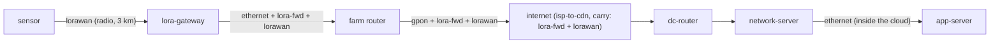

# Plan: IoT and LoRaWAN (issue #2)

Status: **plan only**. Nothing here is built yet. Part of #2.

The issue names two things: **LoRaWAN** (long range, low power: end device → gateway → network server →
application) and **IoT at home** (Wi‑Fi, Zigbee/Thread/Matter, hubs, cloud). This plan does LoRaWAN first, in
detail, because it fits the model with three small, general engine changes. The smart home needs a different route
shape (a trip that ends in your own house), so it gets a sketch and open questions at the end.

## Goal and audience

A soil-moisture sensor in a field sends one tiny reading every so often, by radio, kilometres to a gateway on a barn
roof, and from there over the internet to the company that collects it. It's the opposite of the video: tiny, rare,
slow and far, on batteries that last for years.

- **Kids**: a little stick in the ground that sleeps nearly all the time, wakes up, sings one slow sliding note
  ("wheeee-up!") that a box on a roof three fields away can hear, and goes back to sleep. The box doesn't know what
  the note says; it passes it on. Only the farmer's app has the key to read "the soil is dry".
- **Nerds**: chirp spread spectrum, spreading factors SF7 to SF12 (each step about twice the time on air and a few dB
  more range), 125 kHz channels in EU868 and the 1 % duty cycle; the LoRaWAN MAC frame (DevAddr, FCnt, FPort, MIC);
  two session keys (NwkSKey for the MIC, AppSKey for the payload), so the gateway and the network server carry what
  they can't read; the gateway's packet forwarder (UDP to the network server); deduplication when several gateways
  hear one sensor.

## What the user sees

1. "What are you doing?" in the picker gets **Send a sensor reading**. Picking it moves to the only place where it
   makes sense, **the field**, and the field is offered only for it (not for "Watch a video").
2. **The overview**: a field with a sensor in the soil, a farm with a gateway on the barn roof, and the internet cloud.
   A long, thin radio link crosses the field (`look: 'radio'`, but long: kilometres). Packets are rare: one small
   reading goes up every few seconds of scene time (standing for every 10 minutes), and the sensor dozes ("z z z") in
   between.
3. **Inside the internet**: the same ISP, exchange and border as for the video (the shared segment), then a data
   centre run by the sensor network company: its router, the **network server** and the **application server**.
4. **Dives**:
   - the radio link → **`lora-chirps`** (new link scene, the signal world): the sliding notes, the spreading factor
     ladder (slower and further), the duty cycle;
   - the LoRaWAN envelope, the gateway's forwarding envelope and the locked reading → **`lora-frame`** (new layer
     scene, the paper world), one scene for three layers, varying by layer and by hop: sealed at the gateway, checked
     and de-duplicated at the network server, opened at the application server;
   - later, the sensor and the gateway as **device dives** (`sensor-inside`, `gateway-inside`).
5. **The peek** follows a reading: at the gateway the LoRaWAN envelope gets wrapped in an internet envelope; the
   routers read only that outer envelope; the network server unwraps it, checks the seal and passes on the still-locked
   box; the application server opens it ("Soil moisture 23 %").

## How it fits the engine

The issue's comment sketched it in the model's terms (nodes, a technology, a scene, a place, an activity with
`only`). Since then the model gained layers with roles, seals and tunnels (#5, #8, #17), owners (#20), groups inside
groups (#35) and layer dives (#13). Mapped onto today's model:

| Kind | Id | What |
|---|---|---|
| Node | `sensor` | `device`, role `endpoint`, no IP address. Art: a stake in the soil with a little antenna. Later `dive: 'sensor-inside'`. |
| Node | `lora-gateway` | `device`, role `bridge` (it passes on what it hears without reading it), with an address: it is where the forwarding tunnel starts. Art: a white box with a tall antenna on a roof. Later `dive: 'gateway-inside'`. |
| Node | `network-server`, `app-server` | `device`s in a data centre; roles `router` (it reads the LoRaWAN envelope to find whose sensor it is) and `endpoint`. Art: reuse the CDN server's art through a relative import (allowed for content Svelte), so no new eager art. |
| Owner | `sensor-net` | "The sensor network company" (kid) / "LoRaWAN network operator · AS64510" (nerd; a documentation AS number not used yet). |
| Technology | `lorawan` | `look: 'radio'`, `stack: ['lorawan']`, `dive: 'lora-chirps'`, a colour. |
| Layer | `lorawan` | The LoRaWAN MAC frame: `mhdr`, `devaddr` (kid: "Sensor's number"), `fctrl`, `fcnt` (kid: "Message number"), `fport`, `mic` (kid: "Seal"). `openAt: ['endpoint', 'router']`. `dive: 'lora-frame'`. |
| Layer | `lora-fwd` | The gateway's forwarding envelope: `tunnel: true` like GTP‑U, with the outer IPv4 and UDP (port 1700) and the metadata the gateway adds (`freq`, `sf`, `rssi`, `snr`; kid: "How loudly I heard it"). `dive: 'lora-frame'`. |
| Layer | `lora-app` | FPort's payload, encrypted with the AppSKey: `seals: true`, `openAt: ['endpoint']`. `dive: 'lora-frame'`. |
| Layer | `reading` | The measurement itself (CayenneLPP for nerds: `moisture`, `battery`), `openAt: ['endpoint']`; sealed wherever `lora-app` isn't opened. |
| Scene | `lora-chirps` | Link scene: the radio signal. |
| Scene | `lora-frame` | Layer scene for `lorawan`, `lora-fwd` and `lora-app`, switching on `subject.layer` (as `sticker-doors` serves Ethernet, VLAN and MPLS). |
| Segment | `lora-cloud` | Inside the `datacentre` group: `dc-router` → `network-server` → `app-server`, owner `sensor-net`, its links `dc-fibre` with `stack: ['ethernet', 'lora-fwd', 'lorawan']` up to the network server and plain `['ethernet']` after it. |
| Place | `field` | The sensor, the radio link, the gateway on the barn, an Ethernet cable to the farm's router, fibre to the ISP's cabinet, backhaul, BNG (as `home`, with the carried layers on each link). Backdrop: a field, a barn, a farmhouse. `activities: ['send-reading']` (below). |
| Activity | `send-reading` | `route: [{ place: 'me', only: ['field'], default: 'field' }, { segment: 'isp-to-cdn', carry: ['lora-fwd', 'lorawan'] }, { segment: 'lora-cloud' }]`; groups `internet` and `{ id: 'datacentre', in: 'internet' }`; one flow `reading`, `stack: ['lora-app', 'reading']`, one packet kind `reading`, `dir: 'up'`, slow `pace`, long `every`. |

The stacks per link (outermost first; the flow's `lora-app › reading` is on every link):

| Link | Frames | Who reads what |
|---|---|---|
| sensor → gateway | `lorawan` | The gateway (bridge) reads nothing: `lorawan` closed, `lora-app` closed, `reading` sealed. |
| gateway → farm router → … → BNG | link layers + `lora-fwd` + `lorawan` | Routers read the outer `lora-fwd` header only (the new tunnel-interior rule, below). |
| through the internet (`isp-to-cdn`) | its link layers + `lora-fwd` + `lorawan` (carried) | As above. |
| dc-router → network server | `ethernet` + `lora-fwd` + `lorawan` | The network server ends the tunnel and the LoRaWAN envelope (it opens `lorawan`: checks the MIC, the counter, finds the device), but `lora-app` stays closed and `reading` sealed. |
| network server → app server | `ethernet` | The application server opens `lora-app` and reads the reading. |

The packet model already does most of this "just by being what it is" (`model/packet.ts`): a layer present on both
sides of a hop is *kept*, one only on the way out is *added* (the gateway adds `lora-fwd`), one only on the way in is
*removed* (the network server removes `lora-fwd` and `lorawan`); `seals` locks what's inside for hops that don't open
it; `tunnel` takes `{tunnel.src}`/`{tunnel.dst}` from the ends of its run.

### Engine changes (small and general)

1. **Places that fit only some activities.** `only` on an activity's place slot already keeps `send-reading` to the
   field. The other way round is missing: "Watch a video" lists every place, and listing all of them in its `only`
   would break "add a place, it works everywhere". New optional `activities: [<activity id>…]` on a place: the
   activities it makes sense for (default all). `normaliseChoice`, the picker's `allowed` list and the validation's
   place × activity walk respect both. A future airplane or garden that works for everything simply doesn't set it.
2. **Layers carried over a shared segment.** The forwarding tunnel and the LoRaWAN envelope must ride every link of
   `isp-to-cdn`, whose links don't know about LoRa. A route step may say `carry: [<layer>…]`: layers added to each of
   its links' stacks, after the link's own (`resolve.ts`, where `link.stack ?? tech.stack` is computed). The place
   and `lora-cloud` set their own links' stacks explicitly, as the street does for GTP. A VPN across the internet
   (WireGuard) would use the same thing later.
3. **Inside a tunnel, hops read only the tunnel.** Today every tunnel (GTP‑U) spans one link, so no hop sits inside
   one. Here routers sit inside the `lora-fwd` run, and by role they would "open" the `lorawan` envelope inside
   (`openAt` includes `router`, for the network server). The rule: a hop strictly inside a tunnel's run sees the
   layers inside the tunnel as closed; its ends see them as their roles say. It's what a tunnel is, and it holds for
   GTP too. `hopView` in `packet.ts`, tested on the field route and a fixture.

No engine change names a LoRa id. `src/` stays free of content ids (the import-boundary test in
`model/content.test.ts`).

## New scenes and their descriptions

Every scene a reader can reach gets a `describe`, kid and nerd, in English and Danish (`content.test.ts` fails without
one). Drafts below (the Danish is a first draft for review); the variants not drafted here are drafted in their PR.

### `lora-chirps` (link scene, the signal world)

A wide field: the sensor on the left, the barn with the gateway far on the right. Above, a frequency-over-time strip:
each chirp is a line sliding up across the 125 kHz channel and wrapping around, its start position carrying the bits.
A ladder of spreading factors (SF7 to SF12): the higher, the slower the slide, the longer the message is on the air
(about 60 ms at SF7, about 1.5 s at SF12 for a 12-byte reading) and the further it reaches; rings on the field show
the reach. A clock face shows the duty cycle: on air at most 36 s an hour. Nerd tags: SF, BW, time on air, the EU868
channel. Maths in `chirp.ts` (the time-on-air formula, the loop on `view.time`), tested. Layouts for landscape,
portrait and short landscape; raw `<text>` sized with `legibleSize()`.

| | en | da |
|---|---|---|
| kid | A field with a little sensor on the left and a barn with a box on its roof far to the right. The sensor sings one slow sliding note, again and again, and rings spread over the field. A ladder shows slower notes reaching further rings. A clock shows the sensor may only sing a tiny bit of every hour. | En mark med en lille sensor til venstre og en lade med en boks på taget langt til højre. Sensoren synger én langsom glidetone igen og igen, og ringe breder sig over marken. En stige viser, at langsommere toner når længere ud. Et ur viser, at sensoren kun må synge en lille smule hver time. |
| nerd | A sensor and a gateway kilometres apart under a frequency-time plot: LoRa chirps sweep across a 125 kHz channel, a data symbol's start offset carrying its bits. A ladder runs SF7 to SF12, each step doubling time on air, from about 60 ms to 1.5 s for this frame, and widening the reach rings. A dial shows the 1 % duty cycle. | En sensor og en gateway kilometer fra hinanden under et frekvens-tid-plot: LoRa-chirps fejer hen over en 125 kHz-kanal, og hvert symbols startpunkt bærer dets bit. En stige går fra SF7 til SF12; hvert trin fordobler sendetiden, fra omkring 60 ms til 1,5 s for denne ramme, og gør rækkeviddens ringe større. En skive viser 1 %-reglen for sendetid. |

### `lora-frame` (layer scene, the paper world)

Staged like the other layer dives (a road along the bottom with the sensor, the application server and this hop;
paper cards above; big walking parcels), and varying by layer and hop, most general first (`subject.open`, then
`ctx.to.role`, then facts), never by node id:
- **`lorawan`, open** (the network server): the envelope with the sensor's number, the message number and a wax seal;
  the server checks the seal with the network key, throws away a copy that a second gateway also heard, and passes on
  the locked box inside.
- **`lorawan`, sealed** (the gateway): the gateway can't read the envelope at all; it passes on everything it hears,
  even from sensors of other networks.
- **`lora-fwd`** (the gateway, the routers, the network server): the radio letter goes into an internet envelope
  addressed to the network server, with a note of how loudly it was heard; routers read only that.
- **`lora-app`** (the application server; sealed everywhere else): the box only the app key opens; inside, "Soil
  moisture 23 %".

| Key | en kid | en nerd |
|---|---|---|
| `describe` | A road runs from the sensor in the field to the app's computer. Above it, a card shows an envelope with the sensor's number, a message number and a wax seal, and a locked box inside. Here the seal is checked, a second copy of the same letter goes in the bin, and the locked box walks on. | The LoRaWAN MAC frame at the network server: MHDR, DevAddr, FCtrl, FCnt, FPort and the MIC over it all. The server verifies the MIC with the NwkSKey, checks the frame counter, drops the duplicate from a second gateway, and forwards the FRMPayload, still AES-encrypted with the AppSKey, to the application server. |
| `sealed.describe` | The gateway on the barn holds a letter it can't open. It doesn't even look: it puts every letter it hears straight into a bigger envelope for the internet. | At the gateway the frame is opaque: the packet forwarder doesn't verify the MIC or know the device, and forwards every frame it demodulates, from any network, with its radio metadata. |

| Key | da kid | da nerd |
|---|---|---|
| `describe` | En vej går fra sensoren på marken til appens computer. Over den viser et kort en kuvert med sensorens nummer, et beskednummer og et laksegl og en låst kasse indeni. Her bliver seglet tjekket, en kopi af det samme brev ryger i skraldespanden, og den låste kasse går videre. | LoRaWAN-rammen på netværksserveren: MHDR, DevAddr, FCtrl, FCnt, FPort og MIC over det hele. Serveren tjekker MIC med NwkSKey og rammetælleren, smider kopien fra en anden gateway væk og sender FRMPayload videre til applikationsserveren, stadig AES-krypteret med AppSKey. |
| `sealed.describe` | Gatewayen på laden holder et brev, den ikke kan åbne. Den kigger slet ikke: Den putter hvert brev, den hører, direkte i en større kuvert til internettet. | På gatewayen er rammen lukket: Packet forwarderen tjekker ikke MIC og kender ikke enheden; den sender hver ramme, den kan demodulere, fra alle net, videre med sine radiodata. |

`lora-fwd.describe`, `lora-app.describe` and `lora-app.sealed.describe` are drafted in PR 3.

### The field's overview and the cloud

| Key | en kid | en nerd |
|---|---|---|
| `place.field.describe` | A big field with a little sensor stuck in the soil. Far across it, a barn has a box on its roof, and a cable runs from the farm to the internet cloud. Every now and then the sensor sends one tiny reading up to the barn, then goes back to sleep. | The overview of a field: a battery LoRaWAN soil sensor, a gateway on a barn kilometres away, and the farm's fibre to the ISP. One small uplink leaves the sensor every few minutes; nothing comes back. |
| `place.field.inside.datacentre.describe` | Inside the sensor company's building, a router passes the letter to a computer that checks it, and on to the app's computer, which finally opens it. | The network operator's data centre: its router, the network server that terminates the gateway's tunnel and the LoRaWAN MAC, and the application server that decrypts the payload. |

| Key | da kid | da nerd |
|---|---|---|
| `place.field.describe` | En stor mark med en lille sensor stukket i jorden. Langt ovre på den anden side har en lade en boks på taget, og et kabel går fra gården til internetskyen. En gang imellem sender sensoren en lille måling op til laden og falder så i søvn igen. | Oversigten over en mark: en batteridrevet LoRaWAN-jordsensor, en gateway på en lade flere kilometer væk og gårdens fiber til udbyderen. En lille besked går op fra sensoren med nogle minutters mellemrum; intet kommer tilbage. |
| `place.field.inside.datacentre.describe` | Inde i sensorfirmaets bygning sender en router brevet videre til en computer, der tjekker det, og videre til appens computer, som endelig åbner det. | Netværksoperatørens datacenter: dens router, netværksserveren, der afslutter gatewayens tunnel og LoRaWAN-laget, og applikationsserveren, der dekrypterer indholdet. |

The internet group's own text for this route (the shared ISP and exchange, but "ending at the sensor company"
instead of a CDN cache) comes from `place.field.inside.internet.*`, as `home-dialup` already does, and the data
centre's caption as a stop (its node text says "the video company's PoP") from `place.field.stop.datacentre.*`.

## Accessibility

- **Descriptions** for every new scene and the field's overview and groups, as above; the announcer and read aloud
  say them on arrival.
- **The list view** needs nothing new: it walks the scene tree, so the field's scenes and the new dives appear with
  their descriptions. The picker's new activity and the field are ordinary buttons with `aria-pressed`.
- **The keyboard in the scene**: SceneKeys and the doors are generic; `focus.test.ts` and `doors.test.ts` cover the
  new route in every orientation. Long radio link: its door badge sits on the link clear of the devices
  (`doors.ts`), checked by `overlap.test.ts` at small-screen sizes in both languages.
- **Night**: all art uses tokens (no literals, `art-colours.test.ts`; no SVG filters). The chirps get night halos the
  way Wi‑Fi waves do (a wider, translucent copy of the stroke, `{#if view.mode === 'night'}`). The barn's lamp and the
  farmhouse windows use the light tokens (`--lamp`, `--window`). Every label in the new scenes is `Text` (it gets its
  `--paper` halo) or raw `<text>` with `stroke="var(--paper)" paint-order="stroke"`; ink on bright bodies is
  `--face`. The technology's `colour` is checked as a label by `contrast.test.ts`; `npm run evaluate -- --only=a11y
  --mode=night` checks the drawn labels.
- **Not by colour alone**: spreading factors get their numbers and lengths, not only colours; the sealed box has a
  padlock shape and a dashed edge (as `Panel`'s `sealed`).
- **Reduced motion**: the chirp loop and the dozing "z z z" are decorative motion and stand still under `view.still`;
  the packets follow the engine's rules.

## Viewports and modes

Every path scene and dive gets layouts for landscape, portrait and the short landscape (844×390), as `ip-post`'s
`layoutFor` does: in short landscape, fewer labels and bigger text (no text under 14 px, `legibleSize()`). The long
radio link is the layout risk on a portrait phone: the field runs bottom to top, the barn at the top, with the
internet beside it. Screenshots in each PR: day and night, phone and desktop and short landscape.

## Lazy loading and the eager-JS budget

Main is about **92.7 kB gz eager**. What LoRa adds where:

| Piece | Eager? | Estimate | Note |
|---|---|---|---|
| Definitions (nodes, technology, layers, owner, segment, place, activity) | yes (registry globs) | ~0.6 kB | data only |
| English strings outside dives (node, place, activity, owner, technology names and captions) | yes | ~0.8 kB | the place's and activity's captions are the bulk; keep them tight |
| Layer and scene strings (field names, dive captions, describes) | no | | the lazy `virtual:dive-strings` chunk |
| `sensor` and `lora-gateway` art | yes (node art loads up front) | ≤ 0.4 kB each | vocabulary classes, no gradients, no `{...attrs}` spreads |
| `network-server`, `app-server` art | yes | ~0.05 kB | a relative import of the CDN server's art |
| The field's backdrop | yes (backdrops load up front) | ≤ 0.8 kB | reuse home's sky and hills from the theme; draw the barn and furrows simply |
| `lora-chirps`, `lora-frame` | no | 3–6 kB each | lazy dive chunks |
| Engine changes (place `activities`, `carry`, tunnel interior) | yes | ~0.2 kB | |

Target: **≤ 2.5 kB gz eager** for the whole of LoRa, reported per PR. If PR 1 lands above about 1.5 kB, the next
step before more places is **lazy place art**: backdrops and device art of places not on the start route load when the
picker or a URL asks for them (prefetched when the picker opens), with the theme's fallback body until then. That
would also pay for the time machine's eras (#59) and more access variants (#3); see the open questions.

## Performance

The field is light: one slow packet kind, a radio link drawn with the theme's `radio` look. The `lora-chirps` loop
must avoid what cost frames before: no group `opacity`, no animated `stroke-dashoffset` on long paths; draw each chirp
as a short polyline moved by a transform. PR 2 adds evaluate phases: the morph from home to the field (switching
activity), the fly into `lora-chirps` and its idle, and the `lora-frame` dive from the peek. Budget p95 ≤ 16.8 ms at
6× CPU, with the evaluate lock.

## Tests

- **Engine**: place `activities` in `normaliseChoice` and the picker's list (a fixture place with and without it);
  `carry` in `resolve.ts` (the carried layers on every link of the step, after the link's own, nowhere else); the
  tunnel interior in `hopView` (routers inside the `lora-fwd` run see `lorawan` closed, its ends by role; GTP on the
  street unchanged).
- **The packet model on the field**: every value on every link resolves; the gateway adds `lora-fwd` (its
  `{tunnel.src}`/`{tunnel.dst}` are the gateway and the network server); the network server removes `lora-fwd` and
  `lorawan`; `reading` is sealed at the gateway, the routers and the network server, and open at the application
  server; no IP layer on the radio link.
- **Content walks** cover the new route for free: validation, the scene tree, all the way down (every layer in a
  link's stack has a dive, carried layers included), the ladder, doors, overlap in every language and orientation,
  catching by kind, and `describe` at both levels in both languages.
- **Scene maths**: `chirp.ts`'s time on air against the Semtech formula (SF7 ≈ 62 ms, SF12 ≈ 1.48 s for a 25-byte
  PHY payload at 125 kHz, CR 4/5), the loop's determinism at a fixed clock.

## PRs, in order

Each says "Part of #2"; the last LoRaWAN one may close it, or leave it open for the smart home.

1. **The field, end to end.** The three engine changes, each with its first user and tests; the nodes (with art), the
   owner, the `lorawan` technology, the four layers, the `lora-cloud` segment, the `field` place with its backdrop,
   the `send-reading` activity; strings en+da with every overview and group `describe`. The two dives are required by
   the "all the way down" test, so this PR brings their **first, simple** versions: `lora-chirps` with the sliding
   chirp and the reach rings, `lora-frame` for `lorawan` (open and sealed). This is the big one; everything after it is
   content only.
2. **Chirps, fully.** The spreading-factor ladder, time on air, the duty-cycle clock, two gateways hearing one sensor;
   the evaluate phases.
3. **The envelopes, fully.** `lora-frame` for `lora-fwd` (the gateway's metadata) and `lora-app` (the app key), with
   their describes; deduplication at the network server.
4. **Inside the devices.** `sensor-inside` (a battery, the probe, a microcontroller asleep 99.9 % of the time, a clock
   that wakes it) and `gateway-inside` (eight receivers listening on all channels and spreading factors at once, GPS
   for time, the backhaul), as device dives between the links.
5. **A reply** (optional): a rare downlink in the two short windows after an uplink (class A), as a second packet
   kind `dir: 'down'`: "the sensor only listens for two seconds after it talks".
6. **More places** (optional): a city (a parking sensor; a community gateway on a church tower), reusing everything.

### Later: the smart home (a sketch)

A lamp or thermostat at home on **Thread** (802.15.4 mesh, IPv6 squeezed by 6LoWPAN) behind a border router, on
**Matter**, or on Wi‑Fi to a cloud. Two shapes, both needing design first:
- **From afar**: your phone on the street turns on the lamp at home: phone → internet → the lamp maker's cloud → back
  down to your home router → border router → lamp. The route ends at a place, not a server: the activity's second
  place slot (`friend`-style, designed in but unused) at the far end, drawn reversed.
- **At home**: phone → Wi‑Fi → the border router → lamp, never leaving the house. Places today always end by joining
  the internet, so a local trip needs a route that ends inside the place.
Nice dives would be `thread-mesh` (hops between mains-powered devices, sleepy end devices) and a `6lowpan` layer dive
(the big IPv6 envelope folded small). A separate plan, after LoRaWAN.

## Risks

- **The flow's stack is the same on every link.** LoRaWAN has no IP at the sensor; the internet part is carried
  inside the gateway's tunnel. The plan keeps the one-flow-stack rule and uses a tunnel plus `carry`; the
  alternative (per-link replacement of the upper stack, with IP addresses taken from the ends of a partial run) is
  more general but touches the IP dive and the packet model's client/server addressing. Recorded as an open question.
- **Between the network server and the application server** the real interface is HTTP/JSON or gRPC over TLS; the
  plan shows a plain link inside one company's data centre. The nerd caption says so.
- **No NAT at the farm** in v1: the gateway's tunnel source is its own address (`tunnel` takes it from the hop), and
  a NAT rewrite of a tunnel's outer address isn't modelled. Real gateways often sit behind NAT (they only talk
  outwards, so it works). The caption mentions it; modelling it is a later engine change.
- **Eager growth** from art, backdrop and strings (above); measured in PR 1, and lazy place art if needed.
- **The long radio link** is a new layout shape on a portrait phone; `overlap.test.ts` will say where it crowds.
- **"Rare" packets are hard to catch.** If a reading goes up only every few seconds, catching one takes patience;
  the catch chips (catching by kind, #74) already start a packet where it enters the view.
- **The Danish drafts** need a native review.

## Open questions / decisions made

Decided for now (the user may overrule any of them):
- **LoRaWAN first, the smart home later**, in its own plan: it fits today's route shape; the smart home doesn't.
- **One place, the field**, with the farm's fibre as the gateway's backhaul (not 4G, which would put a GTP tunnel
  around the LoRa tunnel).
- **Three general engine changes** (place `activities`, route-step `carry`, tunnel interior), rather than a per-link
  upper stack; see *Risks*.
- **The sensor has no IP address**, and IP appears only inside the gateway's tunnel; kids see "the box on the barn puts
  the letter in an internet envelope".
- **One layer scene (`lora-frame`) for the three LoRa envelopes**, as `sticker-doors` serves three layers; the
  `gtp-tunnel` scene is GTP-specific (it names the cell tower and mobile core), so it isn't reused.
- **Uplink only** at first; the downlink windows are PR 5.

Still open:
- Should the app's end be the farmer's phone (the reading shown on a screen), which needs a route ending at a second
  place slot, or is the application server enough?
- A field, a garden or a city as the first place? (The field tells the "far and slow" story best.)
- Is lazy place art worth doing before more places arrive (here, #59's eras, #3's cable variant)?
- How literal should the time be: a reading every few seconds of scene time with a caption "every 10 minutes", or a
  visible clock that skips?
