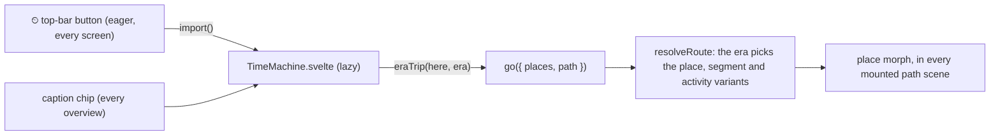

# Plan: the time machine (issue #59)

Status: **revised and decided 2026-10-02** after user feedback, before any more code. Part of #59. On main (#94, the first
plan's PRs 1 and 2): the eras 1995, 2010 and today as content (`content/eras/`), an `era` on the four home places,
`timeStops`, a "Travel in time" chip in the caption of the home's overview, and the lazy panel
(`ui/TimeMachine.svelte`). Everything in *PRs, in order* is new work. It builds on the access technologies of #3
(#82, #83) and the data centre of #35 (#78).

What changed from the first plan, in short:
- **Time travel is a headline feature**, reachable from every screen (the top bar), not a chip on one overview.
- **An era is a whole trip**: the device, the way online, the internet, the data centre, the server *and what you do*.
  1995 is a beige desktop PC on dial-up opening a web page from a server room across the Atlantic; 2010 is a laptop on
  Wi‑Fi and DSL watching a small YouTube-era video from a CDN and a three-tier data centre; today is a phone on fibre
  (or 5G) streaming from a cache nearby, through a leaf–spine fabric.
- This drops two decisions of the first plan: "an era switch is only a place switch within a family" and "the
  internet inside stays today's". The first plan's PR 5 (the 1995 PC and props) and optional PR 7 (the internet in
  time) move to the front. Activities get era variants too (user feedback, the same day).
- **A light "era flavour" layer**: a few small, charming props per era (a wall calendar and a blinking modem in 1995,
  a router with antennas in 2010, a smart speaker today), lazy and per era. It takes in the first plan's "props" PR.
- **1985, before the internet** (a home computer dials one BBS) is the step after the three trips (decided).
  Later and optional: a **communication line** across the eras (BBS → IRC → instant messaging → an end-to-end
  encrypted messenger).
- **The decisions are settled** (user, 2026-10-02): see *Decisions*. Each era shows what was really available at the time;
  a ~2002 broadband era is now planned (#115), which reverses the earlier "no ADSL or 2002 era".

## Goal and audience

Turn a dial, pick a year, and take *the same kind of trip* with the technology of that year. The point is what
**changed** (devices, ways online, speed, who is in the middle, what you could even do) and what **stayed the same**
for 30 years (packets, addresses, envelopes inside envelopes, routers reading the address).

- **Kids** see the whole world change: a beige computer with a deep screen and a telephone that is busy while you're
  online; a laptop on the sofa with a blinking box by the phone socket; today's phone. They open the internet and find
  a small room with a few computers on shelves in 1995, a big hall in 2010, a huge one nearby today. One line tells
  them how long things took: "In 1995 this page with one picture took about 15 seconds to arrive."
- **Nerds** get the numbers and the protocols: V.34 and PPP, calls handed to the ISP on an E1 PRI, a leased E1 line
  to a carrier, a transatlantic cable with a few gigabits for *everyone*, an ATM backbone with its cell tax, a T1;
  ADSL2+/VDSL2, CDNs, three-tier networks with spanning tree; GPON, leaf–spine and ECMP; plain HTTP in 1995 and 2010,
  TLS everywhere today.

## What the user sees

1. **A time button in the top bar, on every screen** (overview, inside the internet, in any dive). It shows a clock
   and the era you are in: "Today", "2010", "1995" ("I dag" in Danish). It is the "where in time am I" sign and the
   way in, so the old open question "should the era show all the time?" is answered: yes, there.
2. **On the overview** the caption keeps its "Travel in time" chip, now on **every place's** overview (the street and
   the desk too), so the first screen a new reader sees has a clear, named entry.
3. **The first-run coach marks** get a last card pointing at the top-bar button: "Hop in the time machine: see this
   trip in 1995 or 2010." Readers who already had the coach marks see only this new card, once.
4. **The panel** is the one on main (the user liked it): a dialog with a native radio dial, each era with its picture,
   year and way online, its text on choosing, and a "Travel to 1995" button. Two changes:
   - Every era is offered from everywhere. The picture of an era is now **its start device** (the PC, the laptop,
     the phone), the most telling thing about it.
   - When your place has no trip in that era, the stop says where you'll land instead: "In 1995 you'd have done
     this at home. You'll travel there." (Phones on the street were only for calls then; nerds get a note on GSM
     data, below.)
5. **Travelling morphs the whole trip**: the house's devices swap (the phone shrinks away, the PC pops in), the
   backdrop slides, and if you are inside the internet or the data centre, that scene morphs too: the 1995 server
   room's three shelves replace today's halls. The URL becomes that era's (`#/en/home-dialup/watch-video/internet`),
   so Back undoes the trip in time.
6. **What you do changes with the era** (the activity's wording, packets and layers): open a web page with a picture
   in 1995, watch a small video in 2010, stream one today. The caption says how long it takes, like with like.
7. **Small era touches** around the house: a calendar on the wall, a modem whose lights blink as the page arrives, a
   buffering wheel in 2010, a smart speaker today (*Era flavour*, below).
8. **The picker** ("Where are you?") marks the ways online with their year ("Dial-up · 1995") and says when a place
   would take you back to today.

## How it fits the engine

### One rule: the era picks a member of every family

On main a **place** has variants (`variantOf: 'home'`) and an `era`. The revision gives **segments** and **activities**
the same two fields, and lets the route's era pick among them:

- **The route's era** is the era of the first place slot that has one, else the newest era (`today`). Places without
  an era (the street, the desk) are today's. The place is still the only thing the reader chooses, so there is still
  **one source of truth and no `?era=`**: `#/en/home-dialup/…` says 1995, and everything else follows.
- **Segments**: `content/segments/isp-to-cdn-1995/segment.ts` says `variantOf: 'isp-to-cdn', era: '1995'`. When the
  activity's route says `{ segment: 'isp-to-cdn' }`, the resolver takes the family member of the route's era, else the
  base. The base has no era: it serves every era without its own variant (2010 can reuse today's internet with its own
  words and still be honest, see *Era-accurate content*).
- **Activities**: `content/activities/watch-video-1995/activity.ts` says `variantOf: 'watch-video', era: '1995'`, with
  its own `route`, `groups`, `flows` (packet kinds, pace, sizes, upper stack) and strings. The URL and the picker name
  the **base** (`watch-video`, the family: "get something big from far away"); the era picks the variant. The id
  `watch-video` is internal; what readers see is the variant's title ("Open a web page"). A variant's strings fall
  back to its base's, so it only says what differs.
- **Groups**: an activity's group spec may name the node that draws it: `{ id: 'datacentre', in: 'internet', node:
  'server-room' }`. The instance id (`datacentre`, and so the URL step) stays the same in every era; its art, backdrop,
  name and text come from `server-room`. This is the hop's `{ at, node }` override (`home-dsl` already draws `router`
  as a `dsl-router`), for groups.
- **Nodes** need no new mechanism: an era's segment or place uses `{ at: 'spine', node: 'aggregation' }`. The rule for
  authors (in `authoring.md`): **an instance id names a job in the story, the node names what does it in that era.**
  Keeping ids for the same job (`bng` is "where the ISP lets you in": a modem bank in 1995, a BNG today; `cdn` is "the
  server that sends it to you") keeps URLs and dives alive across a trip in time. Ids for jobs that only exist in one
  era are that era's own.
- **The engine names no era and no content id.** It knows that places, segments and activities may have `variantOf`
  and `era`, that eras have a year, and that the newest is "now".

Validation (with negative fixtures): a variant's base exists and is not itself a variant; members of a family have
distinct eras; a segment's or activity's base has no era; an activity variant has the same place slots as its base;
every era has at least one place (else the dial couldn't go there); an override group node is `kind: 'network'`. The
existing walks over every place × activity (routes, the scene tree, "all the way down", `describe` at both levels in
every language, overlap at small-screen sizes) then cover every era's trip for free, because each place resolves to its
era's segments and activity. An optional `since: <year>` on technologies, layers and nodes, checked against the route's
era, catches anachronisms cheaply (Wi‑Fi in 1995, TLS on a 1985 BBS).

### What the time machine does from where you are

`timeStops` becomes `eraTrip(choice, path, era)`, pure and tested, used by the panel, the chip and the list view:

1. **The place.** Your place's family member of that era (`home` → `home-dialup`); else **the era's own trip**: the
   first place of that era by `order` (from the street in 1995 → `home-dialup`), and the panel and the arrival
   announcement say so ("In 1995 you'd have done this at home"). From an older era back to today you land on the
   family's today member (`home-dialup` → `home`); Back returns to the street if that's where you came from.
   - **Nerd-only note, street → 1995.** Under the arrival line, at the nerd level only: "Getting online from the
     street was just possible in 1995: GSM's circuit-switched data (CSD) sent 9.6 kbit/s, a third of a home modem,
     from a laptop plugged into a GSM phone or with a PC-card modem. Billed by the minute like a call, rare and very
     nerdy, so it gets no trip of its own." The key is generic content, `era.<era>.away.<place>` (here
     `era.1995.away.street`, nerd only, en + da), shown when it exists; no place id in `src/`.
   - **Street → 2010: a phone on 3G, not built yet.** By 2010 phones watched video over 3G, so "you'd have done this
     at home" would be wrong. An era may give its own line for where you are, `era.<era>.instead.<place>` (kid and
     nerd, en + da), which takes the place of "In 2010 you'd have done this at home. You'll travel there." in the
     panel and the arrival: "In 2010 you could watch on your phone too, over 3G. That trip isn't built yet, so here's
     the one at home." (nerds: HSPA, HSDPA's 7.2–14.4 Mbit/s peak and far less in practice, 360p). Step 4 builds the
     trip (#113).
2. **The activity** stays the same family; its era variant comes with the route. (From 1985 on, an era whose variant
   of your activity doesn't exist sends you to that era's first activity, and says so.)
3. **The path** is kept as deep as it can be:
   - A step naming **the old start device** (the first hop of the place: `phone`, `phone~tcp`) is rewritten to the new
     place's start device (`pc`, `pc~tcp`). This "counterpart" rule is generic and helps every place switch (the
     street's phone ↔ the desk's laptop).
   - Other steps keep their instance ids, so `internet/datacentre` stays `internet/datacentre` (the server room in
     1995), and `internet/datacentre/spine` (the leaf–spine dive today) lands on the 2010 three-tier dive, because the
     2010 `spine` hop is an `aggregation` switch with its own dive.
   - Then the **longest valid prefix**, as for any place switch: `internet/datacentre/spine` in 1995 (no spine)
     becomes `internet/datacentre`. A layer dive survives when its hop and layer exist in both trips (`pc~ip` yes,
     `router~ip` in 1995 no: there is no router).
4. **The morph** runs in every mounted path scene, as today. One engine change: a hop whose **node changed** under the
   same instance id (`spine`: a leaf–spine spine → an aggregation switch) cross-fades in place instead of swapping its
   art in one frame.

**Place switching and eras.** The picker keeps the era where it can: in 1995, picking another place takes that
place's 1995 member; a place with none (the street) takes you back to today, and the picker says so under it
("Only today"), and so does the arrival. The access chips stay: they list the whole family, each with its year
("Fibre · today", "Fibre to the building · today", "DSL · 2010", "Dial-up · 1995"), so `home-dsl`, `home-fttb` and
`home-dialup` work as before, and picking "Dial-up" is a trip to 1995 (the top bar says so).

**URLs** (no new parameter; the place carries the era):

| URL | Is |
|---|---|
| `#/en/home-dialup/watch-video` | 1995: the PC, dial-up, "open a web page" |
| `#/en/home-dialup/watch-video/internet/datacentre` | the 1995 server room (same steps as today's data centre) |
| `#/en/home-dsl/watch-video/internet/datacentre/spine` | 2010: inside the aggregation switch (three-tier) |
| `#/en/home/watch-video/phone~tcp` → 1995 | `#/en/home-dialup/watch-video/pc~tcp` (the counterpart rule) |
| `#/en/street/watch-video` → 1995 | `#/en/home-dialup/watch-video` (no street trip then; said so) |
| `#/en/street/watch-video` → 2010 | `#/en/home-dsl/watch-video` until step 4 (a phone on 3G then, not built yet; said so) |
| `#/en/desk/watch-video` → 2010 | `#/en/home-dsl/watch-video` until step 4 (then a laptop on a cable to the DSL router) |
| PR 10: `#/en/home-1985/watch-video` | 1985: the home computer calls a BBS ("download a picture") |

### Content model changes

1. `variantOf` and `era` on **segments** and **activities** (the schema, the registry's family helpers generalised
   from `placeFamily`, the resolver, validation).
2. `node` on an activity's **group spec**.
3. **Strings**: a variant activity's keys fall back to its base's (`activity.watch-video-1995.title` →
   `activity.watch-video.title`); the caption, peek and picker ask through one helper instead of building
   `activity.<id>.…` themselves (four call sites). Variant segments are their own string source, as places are.
4. **`rate` on technologies** (`{ down, up }` in bit/s), overridable per link (`{ link: 'dialup', rate: … }`, since the
   1995 modem is a 28.8k), and **`size` on a packet kind** (bytes of the whole thing the reader waits for: the page,
   the clip, the video). The caption's "how long it takes" line uses the bottleneck of the route and the era's own
   `size`, so it compares like with like.
5. **Era strings** (`era.<id>.name/kid/nerd/describe`) stay as they are; `describe` is rewritten for the new pictures
   (the start devices). New `ui.json` strings: `time.now` (the top bar's "Today"), `time.instead` ("In {era} you'd
   have done this at {place}. You'll travel there."), `time.only` (the picker's "Only today"), `coach.time`; and the
   optional, nerd-only `era.<era>.away.<place>` (the GSM note above).

## Era-accurate content

Simplified on purpose, but every simplification is one a nerd would accept. Instance ids in the tables are jobs that
carry over between eras (bold) or the era's own.

### 1995: a desktop PC on dial-up, a page from across the Atlantic

| Part | What | Notes |
|---|---|---|
| Device | **`pc`** (new node): a beige tower and a deep CRT, an internal modem | Start device; the panel's picture. |
| Access | `dialup` (exists), `rate` 28.8 kbit/s both ways | V.34 (1994); 33.6k came in 1996 and 56k (V.90) in 1998. The era text on main already says so. |
| Exchange | `exchange` (exists): the phone company connects the call and hands it to the ISP on **`pri`** (new technology: an E1 ISDN PRI, 30 calls of 64 kbit/s each in one 2 Mbit/s line) | `modem-call` and `ppp-hello` dives exist; `modem-call`'s "slot 7 of 32" card *is* this PRI. Small ISPs still had walls of ordinary modems on ordinary lines; PRI-fed digital modem racks (Ascend MAX, USR Total Control) took over from about 1995 and made 56k possible later. One nerd sentence. |
| ISP | **`bng`** as a `modem-bank` (new node: a digital modem rack and terminal server), a 10 Mbit/s `ethernet` (10BASE-T) in the rack to **`core`**, the small ISP's one router | PPP gives the PC a public address; no NAT. |
| Out of the ISP | **`e1`** (new technology: a leased line, 2 Mbit/s, PPP or Cisco HDLC framing) to the upstream carrier (**`transit`**, now the main path, in Copenhagen). Aside: **`ixp`** drawn as DIX (founded 1994 at DTU in Lyngby), from `core` over its own `e1`, for Danish traffic only | A small ISP bought its whole internet as one line from a bigger network, often only 64 kbit/s (one timeslot of an E1); some bought a Frame Relay circuit instead (a nerd note). Traffic to the US never touches DIX. |
| Across the sea | **`submarine-sdh`** (new technology, the `submarine` look): CANTAT-3, ~6,000 km to North America; the upstream rents a circuit of a few Mbit/s inside it | CANTAT-3 (1994) landed at Blåbjerg in Denmark: 3 × 2.5 Gbit/s of SDH for every phone call and every byte between Scandinavia and North America. Today's cables carry hundreds of Tbit/s each. |
| The US | **`backbone`** (new instance, node `router`, owner `us-backbone`: "a big American network") over **`atm`** (new technology: IP over ATM on SONET OC-3, 155 Mbit/s, or a DS3 at 45 Mbit/s), ~1,500 km | 1995 backbones (MCI, Sprint, the vBNS) ran DS3s and OC-3 ATM. Packet over SONET took over from about 1997 (Sprint's OC-12 POS backbone), so in 1995 POS is a nerd note at most. |
| The far end | **`t1`** (new technology: 1.5 Mbit/s, 24 timeslots) into a university or company server room in the US (**`datacentre`** drawn as `server-room`, new network node with a backdrop: a few tower servers on shelves), its router, a 10 Mbit/s hub, **`cdn`** as a `web-server` (a beige tower) | In Europe the same site would have an E1, or 64k or ISDN if small. No CDN (Akamai began in 1998–99), no load balancer, no origin aside: this one server *is* the original. Its dive is `server-inside` in a new 1995 mode (one program, one disk, no cache), lazy. |

**Link technologies by era.** The 1995 trip is all **circuits and timeslots** (TDM) until the ATM backbone; no
Ethernet beyond the rooms, no MPLS, no POS. New technologies, all content: `pri`, `e1`, `t1`, `submarine-sdh` and
`atm`, plus a layer `atm`. They reuse the dives there are and add two, so the dive count stays small:

| Technology | Stack | Dive |
|---|---|---|
| `pri` (exchange → modem bank) | `ppp` (still inside the modem's tones) | **`tdm-frames`** (new, one dive for every E1/T1), mode PRI: 30 callers in their slots, slot 0 for sync, slot 16 the D channel ("a call for the ISP"); yours is slot 7, as on `modem-call`'s card |
| `e1` (ISP → upstream, ISP → DIX) | `ppp` | `tdm-frames`, mode leased: all 31 slots bundled into one 2 Mbit/s pipe for PPP frames; a 64k line is one slot |
| `t1` (US → the server room) | `ppp` | `tdm-frames`, mode T1: 24 slots and one framing bit, 193 bits 8,000 times a second |
| `submarine-sdh` (the Atlantic) | `ppp` | `fibre-light`, submarine mode (exists), 1995 strings: SDH, 2.5 Gbit/s per fibre pair, the upstream's circuit inside |
| `atm` (the US backbone) | `atm` | `fibre-light`, long-haul mode (exists, SONET words); the layer `atm` gets **`atm-cells`** (new): the packet cut into 48-byte pieces, each with a 5-byte label, so about a tenth is labels ("the cell tax"), and the label is swapped at every switch, MPLS's ancestor |
| `ethernet` (in the ISP's rack, the server room's hub) | `ethernet` | `copper-pulses` (exists) with a `rate` of 10 Mbit/s and a nerd line for 10BASE-T (two pairs, Manchester code) |

- `tdm-frames` takes its slot card from `modem-call` (moved to a shared art file, so both draw the same 32 slots).
  Its modes are chosen by technology id inside the scene, as `fibre-light`'s are (content, not `src/`).
- Dives that explain today's technology learn the route's era only through strings: a scene reads an optional
  `<key>.<era>` string (e.g. `copper-pulses`' `nerd.1995`) when the route's era has one. One small engine change (the
  dive's subject carries the route's era), in PR 3.
- `dsl-tones`' ADSL mode is not needed for 2010 (#115's ~2002 era will want it).
| Activity | `watch-video-1995`: "Open a web page with a picture", flow `ip › tcp › http` (no TLS), a 40 kB page + picture | SSL 2.0 shipped in Netscape in 1995 for shops, but pages and pictures were plain HTTP. Video was barely possible: stamp-sized clips (160 × 120, a few frames a second) that you mostly downloaded first; the nerd text says so in one sentence. |
| How long | about 15 s for the page at 28.8k ("a whole video like today's: about 4 hours") | |

### 2010: a laptop on Wi‑Fi, DSL, a small video from a CDN

| Part | What | Notes |
|---|---|---|
| Device | **`laptop`** (exists) on Wi‑Fi | Replaces the phone in `home-dsl`; its text is overridden there (`place.home-dsl.stop.laptop.*`: on Wi‑Fi, not a cable). |
| Access | `home-dsl` as on main: Wi‑Fi (802.11n, 2009) → `dsl-router` → `vdsl` to a DSLAM in the street cabinet | Decided: keep VDSL2, and the nerd text remarks that most Danish DSL in 2010 was still ADSL2+ from the exchange; VDSL2 from cabinets was new (TDC from about 2008; ~21 % of broadband by 2012). No separate ADSL era. |
| ISP and internet | today's `isp-to-cdn` (no variant): core, border router, an exchange, a CDN | CDNs and exchanges were everywhere by 2010. The 2010 activity's nerd text says the cache was usually in a bigger city further away. |
| Links | today's: IP/MPLS over 10G Ethernet (or SDH/OTN) on DWDM, `backbone`'s stack as on main | POS was fading by 2010. ATM still carried most ADSL (PVCs to the BRAS), but VDSL2 uses PTM (Ethernet), so this trip has none; one nerd sentence in the 2010 era text. |
| Data centre | `datacentre` 2010 variant through the activity variant: **`dc-router`** (core), **`load-balancer`**, **`spine`** as an `aggregation` switch (new node, dive `three-tier`: core → aggregation → access, one uplink blocked by spanning tree, oversubscription), **`rack-switch`** (access), **`cdn`** cache server | Three-tier was the norm through the 2000s; leaf–spine (Clos, ECMP) spread with the hyperscalers from about 2010 and became the default by the mid-2010s. |
| Activity | `watch-video-2010`: "Watch a small video", 360p (YouTube's usual setting then; 720p HD from 2008), flow `ip › tcp › http` | YouTube moved to HTTPS by default in the mid-2010s. |
| How long | "arrives about 10× faster than you watch it" (a 3-minute 360p video, ~15 MB, at ~8 Mbit/s) | Streaming is "faster than you watch", not "how long". |

### Today: a phone, fibre (or 5G), a cache nearby

As on main: the phone on Wi‑Fi, FTTH (`home`), FTTB, or the street's 5G; the ISP, an exchange, the CDN's data centre
next door with leaf–spine and the cache server; `ip › tcp › tls › http`; HD video ("arrives about 100× faster than you
watch it"). The base activity `watch-video` is today's.

### Sources (checked 2026-10-02)

- Modems: Wikipedia, *Modem* and *V.34*; *Dial-up Internet access*.
- Mobile data in 1995: Wikipedia, *Circuit Switched Data* (one GSM time slot, 9.6 kbit/s, dialled like a modem call);
  Nokia Collection, *Nokia DTP-2 Cellular Data Card* (a PC-card GSM modem, 9600 bit/s, mid-1990s).
- Web video in 1995: Tech Monitor, "VDOnet launches VDOLive … using a 28kbps modem" (1995); Wikipedia, *RealNetworks*.
- CDNs: Wikipedia, *Akamai Technologies* (founded 1998, service 1999).
- Transatlantic: Wikipedia, *CANTAT-3*; atlantic-cable.com, *Danish PTT*; Wikipedia, *MAREA* (today's capacity).
- Links in 1995: Wikipedia, *Primary Rate Interface*, *E-carrier*, *T-carrier*, *Frame Relay*, *Asynchronous
  Transfer Mode* and *Packet over SONET/SDH*; Cisco newsroom, "Sprint dramatically boosts speed and bandwidth on its
  Internet network" (1997, OC-12 POS); Wikipedia, *Ascend Communications* (PRI-fed modem racks); DIX: dix.dk and
  i2.dk, *DIX* (founded May 1994 by UNI•C at DTU, Lyngby).
- Danish DSL: Wikipedia, *Internet in Denmark*; Ericsson/TDC VDSL2 announcement (2007–08).
- Data centres: Al-Fares et al., "A scalable, commodity data center network architecture" (SIGCOMM 2008); Facebook
  Engineering, "Introducing data center fabric" (2014); Wikipedia, *Clos network*.
- Wi‑Fi: Wikipedia, *IEEE 802.11n-2009*. YouTube: Wikipedia, *YouTube* (HD 2008); Google Transparency Report, *HTTPS
  encryption* (YouTube).
- BBSes and FidoNet: Wikipedia, *Bulletin board system* and *FidoNet* (1984, nightly mail hour); textfiles.com, *BBS
  documentary*. IRC: Wikipedia, *IRC* (Jarkko Oikarinen, Finland, 1988). Messengers: Wikipedia, *MSN Messenger*,
  *Skype*, *Signal Protocol*.

## Era flavour (decided)

Not a restyle: a few small, cute details per era that make each trip feel like its time, on top of the theme. They
are decoration, so they never carry meaning the text doesn't; the place's `describe` mentions the one or two a reader
would notice ("a calendar on the wall says 1995").

| Era | Picks |
|---|---|
| 1985 (with its PR) | Green phosphor text on the home computer's and the BBS's screens; a blocky, pixel-art welcome banner on the BBS (drawn with rectangles, no font); a floppy disk on the desk; a Teletext page on the TV (with a nerd note); **the parcel as a little floppy**. |
| 1995 | A soft CRT glow round the PC's screen; a wall calendar ("1995"); a mouse on a mouse pad; an external modem whose lights blink while packets are on the dial-up line; an hourglass by the screen while the page loads; **the parcel with a little stamp**. |
| 2010 | Two antennas on the DSL router; a buffering wheel on the laptop's screen while the video starts; a slider phone on the sofa; a star sticker on the laptop's lid; **the parcel with a glossy highlight**. |
| today | A smart speaker on the shelf (a plain cylinder with a light ring); a skeleton loader (grey bars) on the phone's screen while the video starts; the parcel as it is. |

The 1995 server room and the 2010 data centre carry their era in their own backdrops (beige towers, a hall of grey
racks); no props there.

How it fits:
- **Lazy, per era.** `content/eras/<id>/art/Props.svelte` and, optionally, `content/eras/<id>/art/Packet.svelte`,
  found by a non-eager glob in `render/lazy.svelte.ts` (with the dives' loader) and loaded when a route of that era
  is first shown (and prefetched when that era is chosen in the panel). Until loaded, nothing is drawn: decoration
  needs no placeholder. Eager cost: about 1.1 kB in the end (see *Open questions / decisions made*).
- **Where they go.** A place's overview layout gets named prop spots per orientation, boxes it keeps in
  (`props: { wall: [x, y, w, h], desk: […], modem: […], shelf: […], sofa: […] }`); `Props.svelte` gets
  `{ layer, spots, devices, traffic, age, time, still }` and draws into the spots it knows, skipping those a place
  lacks, and on its devices (`devices`, by stop id) for what sits on one: the CRT glow, the antenna, the sticker, and
  the loaders on the screens. `traffic` (which ways packets go on the first link) drives the modem's lights; `age`
  (how long the place has been shown) the hourglass, the buffering wheel and the skeleton loader, for the first
  15, 5 and 2 s. It is drawn twice: `back` over the backdrop and under the links and devices, `front` over the
  devices (the screens' loaders). Both fade and slide with the place backdrop in the morph.
- **The parcel touch**: the theme's `Packet` slot draws the era's `Packet.svelte` (if any) as a small mark inside
  its own shape, so up and down still differ by shape (#53), not by the era's touch.
- **The top-bar button keeps its clock in every era**, so it stays recognisable; the era is its word.
- **Tokens only**: no colour literals, no SVG filters (`art-colours.test.ts`). The CRT glow is layered shapes with
  opacity; phosphor green needs two new theme tokens (`--phosphor`, `--phosphor-ink`), day and night, in
  `contrast.test.ts`. Text on props (the calendar's year) goes through `Text` with its halo.
- **Motion**: the blinking, the hourglass and the wheel follow `view.time`, so pause stops them, and under reduced
  motion they are still (lit, turned, shown).
- **No brands**: no logos and no product shapes that read as one (a generic slider phone, a plain speaker).
- **Accessibility**: props are `aria-hidden` and not focusable; they never cover a device, a label or a door (the
  overlap test gets the prop spots).

## 1985, before the internet (PR 10, decided: after the three trips)

A 1985 stop shows the world **before** home internet: a home computer and its modem (300 or 1200 bit/s) phone **one
BBS**, a computer with one phone line in someone's house. There is no network in between: just the call through the
exchange. You read the message board or download a small picture, a character at a time. Nerd note: at night, during
the "mail hour", BBSes called each other to pass mail on (FidoNet, 1984), drawn as a dashed side branch from the BBS to
another BBS (an `aside`, which exists).

What it needs from the engine (it is the first trip that is not "client → internet → server"):
- **A route that is only a place**: the variant activity's route is `[{ place: 'me' }]`, the place `home-1985` ends at
  the BBS (an endpoint), and it lists no groups (no internet to open). The caption and the ladder must cope with a
  route without groups; the content tests already walk it.
- **A flow without IP**: `watch-video-1985` ("Download a picture from a BBS") with a stack of one new layer,
  `xmodem` (128-byte blocks, a checksum, ACK or NAK and send again), and its dive `xmodem-blocks`. The packet model
  and `LayerCtx` must allow a flow with no IP layer (no addresses, no ports); a test fixture first.
- **Per-era activities** (above) and the time machine's activity rule (step 2 of *What the time machine does*).
- Its era flavour (green phosphor, the pixel banner, the floppy parcel), as in *Era flavour*.
- Nodes `home-computer` (generic, no brand) and `bbs`; era `1985`; `rate` 1200 bit/s, so the line says "about 4
  minutes for this little picture".
- **Teletext** is a prop on the TV with a nerd note (pages of text sent along with the TV picture), not a trip.
- **An honest line**: most kids weren't online in 1985; the era's text says so (a few had a modem, most had none).

## Later: the communication line (optional; decided: after the content line)

A second activity family with era variants, the "send a message" idea of #10, so the dial tells a second story: who is
in the middle, and who can read your message.

| Era | What | Who can read it |
|---|---|---|
| 1985 | a BBS message board or a one-line chat: everyone dials into the same computer | the BBS's owner (sysop) |
| 1995 | IRC: your server relays to the next and the next, to your friend's | every server on the way |
| 2010 | instant messaging (MSN- or Skype-style): one company's central server reads and forwards | the company |
| today | an end-to-end encrypted messenger: the server forwards but can't read | only you and your friend |

What the engine needs: **two place slots** (`me` and `friend`, designed in but unused) with the friend's access path
walked backwards; **relay paths** (the server ends one connection and starts the next: two legs, each with its own
`LayerCtx`); a message layer per era with `openAt` saying who can read it (`e2ee` sealed even at the server, `im`
open there); **store-and-forward** timing for the BBS (the message waits until your friend calls); the picker's second
slot; and the time machine moving **both** slots to the era. It gets its own update of this plan (or #10's) before
code.

## Accessibility

The rules of #53 (`docs/accessibility.md`), applied to the new parts:
- **The top-bar button** is a `button` with `aria-haspopup="dialog"` and `aria-expanded`. Its name contains its
  visible text (WCAG 2.5.3): "Travel in time: 1995". It sits after Explore and before pause, so it never moves when
  Explore comes and goes. 44 px target (#79), the engine's focus ring, the theme's ink for its icon (forced colours
  too). Esc in the panel gives focus back to whichever control opened it (top bar, caption chip, list view).
- **The panel** stays as built: `role="dialog"`, `aria-modal`, everything behind `inert`, a native radio group,
  choosing separate from going. The "you'll land at home instead" line is part of the radio's description
  (`aria-describedby`), so it is heard before going.
- **After travelling**, focus goes to the caption's heading and the announcer says the arrival: the era, the place's
  `describe`, and, if you were moved, why ("In 1995 you'd have done this at home"). If the path fell back to a
  shallower scene, the announcer says the scene you are in (as for any fallback).
- **The coach mark** is the existing pattern (a card pointing at a control, Next, Skip, Esc).
- **The list view** keeps its "Travel in time" button, now on every place.
- **Night, contrast, art**: new art (the PC, the server room, the tower server, the modem bank, the aggregation
  switch, the BBS later) uses tokens only (`art-colours.test.ts`), no filters, labels with halos; the top-bar
  button's text pairs join `contrast.test.ts`; `npm run evaluate -- --only=a11y --mode=night` per PR.
- **Reduced motion**: the morph is the existing short cross-fade (`view.still`); the node cross-fade in place adds
  no motion.
- **Colour is never the only cue**: the era is a word in the top bar, the current era a ring and "You are here".

## Viewports and modes

- **Desktop**: the top-bar button with its icon and era name; the panel as on main.
- **Portrait phone (390 × 844)**: the controls wrap under the ladder; the button shows icon + era name ("1995" is
  short; "Today"/"I dag" too). PR 1 measures the row at 360 and 390 px in both languages; if it doesn't fit, Explore
  goes icon-only below 400 px before anything else (pause must stay one tap away).
- **Short landscape (844 × 390)**: the slim row; icon + year.
- **Day and night**: tokens only.

## Lazy loading and the eager-JS budget

Main is about **94 kB gz eager** (measured as `architecture.md`'s "Initial JS" paragraph does). Each PR reports its
eager delta against main and updates that paragraph. The **first wave (PRs 1–9) should add at most about 3 kB gz
eager in all**.

| PR | Eager (estimate) | Lazy |
|---|---|---|
| 1. Prominence, a device per era | ~0.6 kB (button + wiring ~0.25, global stops + counterpart rule ~0.15, `pc` art ~0.3, or ~0.05 after #91) | coach card (coach chunk), panel changes |
| 2. Era flavour | ~0.15 kB (lazy glob, mount point, prop spots in the layouts) | each era's `Props.svelte` and `Packet.svelte` (~1–2 kB each) |
| 3. Era variants (engine) + honest flows | ~0.5 kB (schema, resolver, strings fallback, cross-fade; two activity variants' data and English strings) | |
| 4. The street in 2010 (#113) | ~0.4 kB (a 2010 street place and segment with layouts, a 3G technology, English strings) | |
| 5. How long it takes | ~0.3 kB (rates, sizes, bottleneck, `Intl.NumberFormat` units) | |
| 6. 1995: the internet | ~1.0 kB (segment + layouts ~0.3, five technologies, a layer and an owner ~0.2, English strings ~0.3, `modem-bank` art ~0.2, or ~0 after #91) | `tdm-frames` and `atm-cells` dives |
| 7. 1995: the server room | ~0.7 kB (strings ~0.3, `server-room` art + backdrop and `web-server` art ~0.4, or ~0.05 after #91) | `server-inside`'s 1995 mode (its chunk) |
| 8. 2010: the data centre | ~0.5 kB (activity variant layouts, strings, `aggregation` art ~0.2 or ~0 after #91) | `three-tier` dive |
| 9. The picker and eras | ~0.1 kB | |
| 10. 1985 | ~0.6 kB (no-IP flows, route without groups, content) | `xmodem-blocks` dive |
| 11–14. Flats 2010, ~2002, milestones, 1985 lab | estimated in each step's plan update | |

- **#91 (lazy device art and backdrops)** is the big lever: about half of PRs 6–8's eager cost is new device art and
  the server room's backdrop. Done before PR 6 (the "after #91" estimates above apply): each device and backdrop is a
  chunk of its own, loaded with the first route that draws it. Choosing an era in the panel **prefetches the target
  trip's art** (the devices of its route and its backdrops), and the panel loads its era pictures' art with its chunk.
- **Era strings stay lazy** (`era.*` in the dive-strings chunk, as on main). The English strings of era variants
  (places, segments and activities with an older era) are eager like all place strings. If the first wave passes
  +3 kB, the `string-packs` plugin keeps them in a lazy pack that is awaited before an older era's route is shown
  (as `loadDiveStrings`), worth ~1 kB.
- **New dives are lazy by design** (`render/lazy.svelte.ts`). Device art stays lean: vocabulary classes, no
  gradients, no `{...attrs}` spreads.

## Performance

The trip in time is the place morph (about 750 ms), now possibly inside the internet and the data centre too, with more
nodes popping than any morph so far. `npm run evaluate` gets phases for the morph today → 1995 at the overview and at
`internet/datacentre`, and 2010 → today at `internet/datacentre`, with their idles. Budget as everywhere: p95 ≤ 16.8
ms at 6× CPU. Runs take the evaluate lock.

## Tests

- `eraTrip` on the real content and fixtures: the family member, else the era's first place (said), the counterpart
  rule, the longest valid prefix, Back. Every scene path of every era maps to a valid path (or its prefix) in every
  other era.
- Variant resolution: each place resolves to its era's segments and activity; a base serves eras without a variant.
- Validation fixtures for every rule in *One rule* (and `since`, if added).
- Strings: variant fallback; `describe` for every new scene and variant at both levels, en and da (the existing walk).
- The how-long line: the bottleneck along each era's route; formats in en and da.
- The a11y run's keyboard journey from the top bar inside a dive: open, arrow to 1995, Enter; focus on the caption's
  heading; the announcer names the era and, from the street, why you moved.

## PRs, in order

Each is small, leaves main working and says "Part of #59".

1. **Prominent, and a device per era.** The top-bar time button on every screen; the caption chip on every overview;
   `eraTrip` with "the era's own trip" for places without one (and the panel's and the announcer's line saying so,
   plus the nerd-only GSM note from the street to 1995);
   the counterpart rule for the start device; a coach card (and the one-time card for readers who had the coach
   marks); the `pc` node in `home-dialup` and the `laptop` on Wi‑Fi in `home-dsl` (own layouts); the panel's pictures
   become the start devices and the eras' `describe` is rewritten for them (en + da, kid + nerd). The internet stays
   today's in every era for one more PR. Screenshots day and night on phone, desktop and short landscape.
2. **Era flavour.** The lazy per-era props and parcel touches for 1995, 2010 and today (the picks above), prop spots
   in the home places' layouts, the 1995 overview's `describe` updated (en + da, kid + nerd). Takes in the first
   plan's PR 5 ("props"). Screenshots day and night.
3. **Era variants as content.** `variantOf`/`era` on segments and activities, the route's era, group `node`,
   variant string fallback, the cross-fade for a changed node, the route's era on a dive's subject (for `<key>.<era>`
   strings), validation and tests. First callers: the 1995 and 2010
   activity variants with honest flows (no TLS) and wording ("Open a web page with a picture", "Watch a small video").
4. **The street and the desk in 2010** (#113). 2010 members of both families: on the street, the phone on 3G (HSPA)
   to a NodeB and the mobile core; at the desk, a laptop on a cable to the DSL router; era-true words (en + da, kid +
   nerd). The time machine then goes there in 2010, and `era.2010.instead.street` (added in PR 2) goes. The 1995
   desk wording is fixed in the same step. The eras should show what was really available
   at the time (the user's principle): where people really did this in an era, that era gets a trip there.
5. **How long it takes.** `rate` (with the 28.8k override), `size` on each era's packet kinds, the caption line (kid
   and nerd), like with like.
   - **Era packet speed.** In older eras the parcels move visibly slower along the route: a gentle, bounded scale
     (slow, medium, fast, say), derived from the route's bottleneck `rate`, not true to scale (1995's dial-up was
     about 35,000× slower than today's fibre). The caption's "how long it takes" line carries the real difference.
     Under reduced motion and pause it follows the clock as packets do now; it stays within the perf budget (the
     evaluate phases' p95).
   - **Not on rush hour**: rush hour was removed (#114), so this step doesn't build on it.
6. **1995: the internet.** `home-dialup`'s exchange → modem bank link becomes `pri`; `isp-to-cdn-1995`: the modem
   bank, the small ISP's router, an `e1` to the upstream (DIX as the aside), CANTAT-3 (`submarine-sdh`), the US
   backbone (`atm`), a `t1` to the server room; the `tdm-frames` dive (with `modem-call`'s slot card shared) and the
   `atm` layer with `atm-cells`; 1995 strings for `fibre-light` and `copper-pulses`; owners' words; describes. If it
   grows past one review, split off `atm` and `atm-cells` (the backbone drawn as an `e1`-like circuit until then).
7. **1995: the server room.** The `server-room` group node and backdrop, the hub, the tower `web-server` and the 1995
   mode of `server-inside`; no CDN, no origin.
8. **2010: the data centre.** The three-tier variant (`aggregation` with its `three-tier` dive), the cache further
   away in words, the 2010 nerd texts.
9. **The picker and eras.** Year tags on the access chips, "Only today" under places without a trip in this era,
   the arrival line when the picker takes you back to today.
10. **1985: before the internet** (decided; the step after the three trips): `home-1985`, the BBS, the `xmodem` layer and dive,
   a route without the internet, flows without IP, the FidoNet aside, its era flavour (with the phosphor tokens).
11. **The flats in 2010 on cable TV** (#118), with #109.
12. **A ~2002 broadband era** (#115), after the 1995 and 2010 trips are complete: ADSL over ATM; the activity is
    downloading a song (Napster may be named). This reverses the earlier "no ADSL or 2002 era".
13. **Milestones on the dial** (#116): about 5–7 dots for moments in between, with no trip.
14. **The desk in 1985 as a university lab** (#117), after the 1985 BBS: the internet before the web.
15. **The communication line** (optional, later; its own plan update): `send-message` and its era variants, two place
    slots, relays, `e2ee`.

Also optional: **ISDN in 1995** (#119), after step 6. **Today's street stays 5G only**; a full part on the mobile
generations is an idea (#108).

## Risks

- **Three whole trips is a lot of content**: layouts for both orientations, describes in two languages and two levels
  for every new scene. The walks catch omissions; the Danish drafts need a native review.
- **Instance-id discipline.** If an era renames a job's id, its URLs and dives stop surviving a trip. The "every path
  maps" test makes that visible.
- **The top bar on small phones** may not fit one more control (see *Viewports*).
- **Era flavour creep**: props are fun to add. Keep to the picks above (four or five an era) and to the prop spots, so
  they never crowd the scene or cost frames; the evaluate phases include the 1995 overview with its blinking modem.
- **Eager growth**: device art and English strings; mitigations above (#91, a lazy era pack).
- **Anachronisms**: the optional `since` check; each content PR lists its sources.
- **Morph cost**: inside the data centre whole regions swap; the new evaluate phases watch p95.
- **Two "switch" UIs** (the picker's access row, the dial) reach the same places. The year tags make the overlap a
  feature: the access row is "what kind of home", the dial is "when".

## Decisions

Decided (the user may overrule any of them):
- **No `?era=`**: the place carries the era; segments and activities follow.
- **One dial for everything**: eras are global content.
- **Whole trips per era**, each with its own device, access, internet, data centre and activity (2026-10-02).
- **Activities change per era** as variants of one family, named by the base in the URL (2026-10-02).
- **Content line first; the communication line later** (user, 2026-10-02).
- **No era palette** (sepia): devices and the era flavour carry the era.
- **An era flavour layer**: a few small, lazy, token-only props per era, no brands (user, 2026-10-02).

Decided by the user (2026-10-02), the five questions of the first draft of this plan:
1. **The way in**: a time button in the top bar on every screen showing the era, the chip on every overview, and a
   coach card.
2. **Places with no trip in an era** (the street in 1995) travel to that era's home trip and say so; the street → 1995
   arrival adds the nerd-only GSM data note (CSD, 9.6 kbit/s; see *What the time machine does*).
3. **1995's activity** is "open a web page with a picture" (about 15 s), with stamp-sized clips as a nerd note.
4. **2010's DSL** stays `home-dsl`'s VDSL2 from the street cabinet, with the nerd remark that most homes still had
   ADSL2+. (No separate ADSL or 2002 era, at first; reversed on 2 Oct: #115.)
5. **1985's BBS** is wanted: PR 10, the step after the three trips, no longer optional. The communication line stays
   later and optional.
6. **The eras brainstorm** (user, 2 Oct, in a #59 comment): each era shows what was really available at the time.
   Scheduled: the street and the desk in 2010 (#113, step 4), the flats in 2010 on cable TV (#118, with #109), a
   ~2002 broadband era (#115), milestones on the dial (#116), the desk in 1985 as a university lab (#117). Optional
   or ideas: ISDN in 1995 (#119), the mobile generations (#108); today's street stays 5G only. 1985's Teletext is a
   TV prop and a nerd note, not a trip. Rush hour goes (#114); older eras get slower parcels (step 5).

Kept from building #94: one helper for the stops (now `eraTrip`); the clock icon from `ui/icons.ts`, not the emoji;
choosing separate from going; the panel is the picker's dialog; panel strings in `ui.json`, era strings lazy; radios
checked from code; the morph's reduced-motion cross-fade. Revised: the picture of an era is its **start device**, not
the home's connecting box; the first plan's "props" PR became the era flavour; the way in is the **top bar** plus the overview chip, not the chip alone.

## Open questions / decisions made

Made while building PR 1 (the way in and a device per era):
- **Where the stops come from**: `eraStops` (`model/era.ts`) replaces `timeStops`; the place's era is `eraOf` in
  `registry.ts`. `eraTrip` and the panel's words (`ui/time.ts`) load with the panel, not up front.
- **Saying where the era's own trip is** needs a word for each base place: a `where` string ("at home", "on the
  street", "at the desk"), required on base places by validation. The panel line is "In 1995 you'd have done this at
  home. You'll travel there." (`time.instead`, `time.there`); the arrival says "It's 1995." or "Back to today."
  (`time.then`, `time.back`) before why. The GSM note is `era.1995.away.street`, nerd only.
- **The panel's way label** falls back to the place's name where it has no `access` (the street, the desk).
- **The top-bar button is 40 px tall**, like its neighbours (`.btn`), not the 44 px the a11y section suggests; the
  project's floor is 24 px and the row stays even. Its name is "Travel in time: 1995"; its colours are pairs
  `contrast.test.ts` already checks (ink on card, `--btn-on-ink` on `--btn-on` when open).
- **Small phones**: at 360 px the row with the new button overflowed in both languages; below 400 px "What can I
  explore?" is its icon (its name stays, visually hidden), as *Viewports* planned. 390 px fits either way.
- **The coach card**: the fourth card of the first run, on the button. A reader who had the coach marks before
  (`coached` `'1'`) gets it alone, once, labelled "New" with no count and the doors not lit; then `coached` is `'2'`.
  Its line names the other eras from where you are ("…in 1995 or 2010", `Intl.ListFormat` disjunction).
- **The start devices**: a new `pc` node (a beige box with a CRT, its own `learnMore`) in `home-dialup`; `home-dsl`
  gets the laptop on Wi‑Fi with its own overview layout (copied from the home's, the internet's reused). The Wi‑Fi
  frame's bystander device is now whichever of phone and laptop isn't yours, so 2010 shows a phone next door.
- **Left for later PRs**: `home-dialup`'s "56k/V.90" wording (rates; done in PR 2); the dives (TCP, Wi‑Fi frame) still say
  "your phone" in 1995 and 2010 (PR 3, `<key>.<era>` strings).
- **Eager JS**: +1.1 kB gz against main (the plan said ~0.6): the button and wiring ~0.26, the stops ~0.19 (in the
  caption's chunk), the `pc` art ~0.18, and English strings ~0.4 that the estimate left out (the `pc` node's, the
  laptop's stop, `where`, the time keys). Of the wave's 3 kB, 1.9 kB remain; the lazy era pack stays the lever.
- **`home-dsl`'s overview** is the home's (after #72's relayout) with the laptop for the phone; it adds no known
  overlaps.

Made while building PR 2 (era flavour):
- **Prop spots are boxes**, `[x, y, w, h]` round a centre, in a place overview's `props` (validation rejects them
  anywhere else), and the overlap test checks each against every name, tag, door and device in every orientation,
  language and level, so `KNOWN_OVERLAPS` stays empty. Spots: 1995 `wall`, `desk`, `modem`; 2010 `sofa`; today
  `shelf`. Things on a device (the CRT glow, the second antenna, the star sticker, the three loaders) draw relative
  to the device instead and need no spot.
- **The loaders sit on the device screens**, drawn in a front layer over the devices beside the theme's face: the
  hourglass on the PC's screen, the buffering wheel on the laptop's, grey bars above the phone's face. They show for
  a while after the place appears (15, 5 and 2 s: a page in 1995, a video start in 2010 and today), not while
  packets are busy: on the overview packets flow all the time, so "busy" would never end.
- **The modem's lights** follow the packets on the first link: one lit for each way traffic is going, power always.
- **The star sticker is on the palm rest**: the drawing shows the laptop from the front, so its lid's back isn't seen.
- **Today's speaker is on a small wall shelf** (no shelf in the backdrop); the 2010 sofa is a small one on the floor
  next to the laptop, with the slider phone on it.
- **The modem is external** (on a shelf, with lights), so the place's words say so; and the speed is now 1995's:
  28.8 kbit/s, V.34, in `home-dialup` (en + da, kid + nerd) and the `dialup` technology (33.6k came in 1996 and
  56k/V.90 in 1998). The modem-call dive still says V.90 and 56k (its strings, the photo's timing in `modem.ts` and
  `modem-scene.test.ts`): left for PR 5 (how long it takes), where the rates are.
- **"your phone" in the dives** (TCP, Wi‑Fi frame) can't be reworded per place: dive keys are per scene and per
  device (`scene.<id>.<node>`), not per place or era. Left for PR 3 (`<key>.<era>` strings), as PR 1 said.
- **Street → 2010 says what was really there** (asked during review; the user's principle: the eras should show
  what was really available at the time). `era.<era>.instead.<place>` (generic, in `ui/time.ts`, loaded with the
  panel's strings) replaces "In 2010 you'd have done this at home. You'll travel there." for the street in 2010, kid
  and nerd, en + da, so the two lines can't contradict each other; `away` stays the extra note (1995's GSM). The trip
  itself is a new step 4 (#113, now the street and the desk in 2010); later steps moved up by one.
- **The dial-up handshake isn't played when switching to 1995** (it would get old switching back and forth); it
  stays in the modem-call dive. Tapping the modem to play it was skipped: it would make a decoration a real button
  (focus, a name in en + da, keys, and a door-sized target clear of the labels), more than this PR's small touches.
- **One loader for dives and eras**: `render/dives.svelte.ts` became `render/lazy.svelte.ts`, a small generic
  `lazy()` used by both (and by the busy spinner), which costs less eagerly than a second module.
- **Eager JS**: +1.1 kB gz against main (96.2 against 95.2 after rush hour went, #114; the plan said ~0.15): the loader and era glob ~0.3, the
  mount in the root scene and the parcel's mark ~0.35, the places' prop spots ~0.15, and the English words for the
  props in the places' `describe` ~0.16. Mounting the props lazily too was tried and cost more (it split the layout
  chunk). Of the wave's 3 kB, about 0.8 kB remain; the lazy era pack (~1 kB) stays the lever, and PR 3 should take it.
