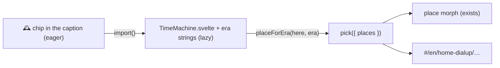

# Plan: the time machine (issue #59)

Status: **PRs 1 and 2 built** (together, in one PR): the eras 1995, 2010 and today on the home family, the 🕰️ chip
and its lazy panel. PRs 3 onward are not started. Part of #59. It builds on the access technologies of #3 (PRs #82
and #83).

## Goal and audience

Turn a dial, pick a year, and see the same trip with the technology of that year: watching a video at home over
dial-up in 1995, over the phone line in 2010, or over fibre today. The point is what **changed** (the way online, the
devices, the speed) and what **stayed the same** for 30 years (packets, addresses, envelopes, the internet's routers).

- **Kids** see the house change around them: a beige computer with a deep screen and a telephone that's busy while
  you're online, then a router with blinking lights, then the fibre box. They hear the modem (behind 🔈). One line
  tells them how long the video would take: "In 1995 this video would take about 2 hours to arrive."
- **Nerds** get the numbers and the protocols: V.90 and PPP, ADSL band plans and PPPoE, VDSL2 vectoring, GPON; the
  bottleneck rate of each era and how long one video takes over it; and, later, what the internet looked like inside
  (no CDNs in 1995, few exchanges).

## What the user sees

1. On the overview of a place whose family has eras (today: `home`), the caption gets a **🕰️ Travel in time** chip
   next to *Change*. In an older era it shows the year instead ("🕰️ 1995", from the era's `year`, so it needs no
   lazy string).
2. The chip opens a small **time machine** panel (a card on wide screens, a bottom sheet on a portrait phone, a
   compact sheet in short landscape). It shows the eras as stops on a dial, oldest to newest, each with its year, its
   way online ("Dial-up", "Phone line (DSL)", "Fibre to the house") and the start device's picture. The current era
   is marked.
3. Picking an era closes the panel and **morphs** the scene to that era's place, the same morph as a place switch
   (devices that stay glide, the rest shrink away or pop in, the backdrops slide). The URL becomes that place's
   (`#/en/home-dialup/watch-video`), so Back undoes the trip in time.
4. Inside a dive, the rules of a place switch apply: the path falls back to its longest valid prefix, and a layer
   dive survives when its hop is in both routes.
5. The caption's trip line gains **how long the video takes** at this era's bottleneck, and for nerds the rate
   ("56k modem: about 2 h for this 50 MB video; under a second over today's fibre").
6. A place whose family has no eras (the street, the desk) shows no chip. The picker's access chips stay as they are.



## How it fits the engine

The groundwork is there from #82 and #83:
- A **place variant** (`variantOf: 'home'`) is another way online from the same place: `home-dsl`, `home-fttb` and
  `home-dialup`. The picker shows the base once, with a row of `access` chips.
- `placeFamily(id, among?)` in `src/model/registry.ts` lists a place and its variants in `order`; `basePlace(id)`
  gives the base.
- The URL names the variant, so every link, dive, list view and Back works as for any place.
- `architecture.md` already says: "An era on each place variant; the switch picks the family member (`placeFamily`)
  of that era, and the route, URL and dives follow as for any place."

So **an era switch is a place switch within a family**, and the engine change is small:
- **No new URL parameter.** The era is a property of the place (`eraOf(place)`), so `#/en/home-dialup/watch-video`
  already says "1995". The issue suggested `?era=1995`; with the era on the place, a second source of truth could
  only disagree with the first. (Decision, see the end.)
- **One function picks the family member**: `placeForEra(id, era, among?)` in `registry.ts`, next to `placeFamily`.
  It returns `id` if that place is already of the era, else the first family member (by `order`) of that era, else
  `null`. Pure, and tested on the real content and on fixtures.
- **Switching place keeps the era where it can.** At `home-dialup` (1995), picking another place in the picker would
  ask `placeForEra(target, eraOf(here))` and fall back to the target itself. No other family has eras yet, so this
  lands with the first one that does (PR 6), not before.
- **The engine names no era.** Eras are content (below). The engine knows only that a place may have an era, and that
  an era has a year.

### Content model changes

1. **A new content kind, `content/eras/<id>/`** (a registry glob, a schema, validation; the kinds and folder-layout
   tables in `architecture.md` get a row):

   ```ts
   // content/eras/1995/era.ts
   import { defineEra } from '$core/define';
   export default defineEra({ year: 1995 });
   ```

   - `year` sorts the dial and dates "how long would it take" texts. Ids are kebab-case (`1995`, `2002`, `2010`,
     `today`; the id regex already allows digits). `today` has the current year.
   - Strings (`locales/en.json`, `da.json`): `name` ("1995", "Today"), `kid`/`nerd` (a sentence or two for the panel:
     what home internet was like) and `describe` (what the panel's picture of that stop shows, see *Accessibility*).
   - Eras are global, not per family, so a later street family uses the same stops and "1995" means the same
     everywhere (decision: one dial for everything, the issue's second open question).

2. **`era` on places** (the `place` schema): `era: '<era id>'`, optional.
   - Validation: the era exists ("did you mean"); within a family either no member has an era or all do; a family with
     eras has at least two distinct ones (else the chip is pointless). Two members may share one: `home` and
     `home-fttb` are both `today`, and the dial picks the first by `order`.
   - Today's content: `home-dialup: '1995'`, `home-dsl: '2010'`, `home` and `home-fttb: 'today'`.

3. **`rate` on technologies** (PR 3): `rate: { down, up }` in bit/s, data like `colour`. Only access technologies need
   it (dial-up 50 k / 33.6 k, VDSL2 100 M / 40 M, GPON 1 G, Wi‑Fi). A link without `rate` is never the bottleneck.

4. **`size` on a flow's packet kind** (PR 3): `{ kind: 'video', …, size: 50_000_000 }`, the whole thing the reader
   waits for (one short video), so the caption can say how long it takes. An activity without a `size` says nothing.

5. **Era-specific words** need no new mechanism where a place can already say them: the variant place is the most
   specific string source on its route, so `place.home-dialup.*` already overrides the stops' captions and
   `inside.internet.nerd`. If the activity's own title must change per era ("You wait for a video to download"),
   PR 3 checks whether a place can already override `activity.<id>.title`; if not, it adds
   `place.<id>.activity.<activity>.*` as the most specific source in `model/describe.ts` (`sceneKeys`), tested.

### The internet in 1995

The first version keeps **today's internet** inside the cloud for every era, and says so: the 1995 place's
`inside.internet.nerd` (it exists) gains "In 1995 there were no CDNs; the video would come from one server, maybe
across the Atlantic". Making the internet itself era-aware (no CDN, one origin far away, a thin transatlantic line)
needs era alternatives for segments (`{ segment: 'isp-to-cdn', era: { '1995': 'isp-to-origin' } }`): a bigger engine
change, left as an open question and an optional PR 7.

## New scenes, dives and places

Every new scene, and every new variant of one, gets a `describe` in English and Danish, kid and nerd
(`content.test.ts` walks every place × activity × orientation and fails without one). Drafts are below; the Danish is
a first draft for review.

### PR 4: the 2002 era, `home-adsl`

A new place variant: a laptop on early Wi‑Fi (802.11b) to a Wi‑Fi box, a cable to an ADSL modem-router, then the
phone line to a DSLAM **in the exchange** (ADSL ran from the exchange, not the street cabinet: about 3 km), then the
ISP. PPP lives on (PPPoE/PPPoA), so the `ppp` layer and its `ppp-hello` dive carry over from dial-up: a nice "what
stayed the same".

- Technology `adsl`: look `cable`, stack `['ppp']`, `rate` 8 M / 1 M, dive `dsl-tones`.
- `dsl-tones` gets an **ADSL mode** picked from `subject.link.tech` (as `fibre-light` picks its access, metro and long
  haul modes): fewer and lower bands (up to 1.1 MHz, against VDSL2's 17 MHz), and the phone's voice band kept free at
  the bottom with a **splitter**, so the phone and the internet work at the same time (the change from dial-up kids
  should notice). It gets its own `adsl.title`.
- Reused devices: `laptop`, `ap`, `dsl-router`, `dslam`, `exchange`. Layout: the home's spots, the laptop where the
  phone is.

| Key | en kid | en nerd |
|---|---|---|
| `place.home-adsl.describe` | The cut-away house has a laptop on the sofa and a Wi‑Fi box on the wall. A cable runs to a little modem by the telephone, and the phone line goes out to the internet cloud. Requests go out and video comes back, faster than dial-up but still slowly. | The overview of a 2002 home: a laptop on 802.11b Wi‑Fi to an access point, Ethernet to an ADSL modem-router, then the copper phone pair to a DSLAM in the exchange. The router does NAT and runs PPPoE to the ISP. Requests go up and video comes down at a few Mbit/s. |
| `scene.dsl-tones.adsl.describe` | A phone line runs from the house to the exchange. At the bottom of a long ladder of notes, your voice has its own low corner; above it, many small notes carry the internet, a few going up and many coming down. A splitter by the phone keeps them apart. | A frequency plot of one copper pair: voice below 4 kHz, then ADSL's discrete multitone, 25 upstream tones up to 138 kHz and 223 downstream up to 1.1 MHz, each loaded with bits by its noise. A splitter separates voice and data. The bars shrink with distance from the exchange. |

| Key | da kid | da nerd |
|---|---|---|
| `place.home-adsl.describe` | Huset er skåret op: en bærbar i sofaen og en Wi‑Fi-boks på væggen. Et kabel går til et lille modem ved telefonen, og telefonlinjen går ud til internetskyen. Forespørgsler går ud, og video kommer tilbage, hurtigere end med opkald, men stadig langsomt. | Oversigten over et hjem i 2002: en bærbar på 802.11b-Wi‑Fi til et access point, Ethernet til en ADSL-router og så telefonens kobberpar til en DSLAM i centralen. Routeren laver NAT og kører PPPoE til udbyderen. Forespørgsler går op, og video kommer ned med nogle få Mbit/s. |
| `scene.dsl-tones.adsl.describe` | En telefonlinje går fra huset til centralen. Nederst på en lang stige af toner har din stemme sit eget dybe hjørne; ovenover bærer mange små toner internettet, nogle få op og mange ned. En splitter ved telefonen holder dem adskilt. | Et frekvensplot af ét kobberpar: tale under 4 kHz, derover ADSL's mange bærebølger, 25 op til 138 kHz og 223 ned til 1,1 MHz, hver fyldt med bit efter støjen. En splitter skiller tale og data. Søjlerne bliver lavere, jo længere der er til centralen. |

The eras' own `describe` (for the panel's pictures) follows the same pattern, e.g. `era.1995.describe`: kid "A beige
computer with a deep, heavy screen, and a telephone beside it" / "En beige computer med en dyb, tung skærm og en
telefon ved siden af"; nerd "A desktop PC with a CRT and an internal 56k modem on the phone line" / "En stationær pc
med en billedrørsskærm og et indbygget 56k-modem på telefonlinjen".

### PR 5: props for 1995

- A node `pc` (a beige tower with a deep CRT) replaces the `laptop` in `home-dialup`, with a `face` on the screen.
- A small wall calendar in each era's backdrop ("1995", "2002", …), drawn with `Text` (it gets a halo by itself) so it
  stays readable at night. No new scene, so no new `describe` key, but the 1995 overview's `describe` changes ("a beige
  computer with a deep screen") in both languages and at both levels.

No other new dives are needed for the first eras: `modem-call` (the handshake, with its sound), `ppp-hello`,
`dsl-tones` and the fibre dives cover them. Mobile eras (PR 6) would add a **`gsm-slots`** dive (eight time slots
taking turns: GPRS), with its `describe` drafted in that PR.

## Accessibility

The rules of #53 (`docs/accessibility.md`), applied to the new parts:
- **The panel** is a `role="dialog"` with `aria-modal` and `aria-labelledby`, like the place picker: everything behind
  it is `inert`, it takes focus on open (on the current era), Esc closes it and gives focus back to the chip, and a
  click outside closes it.
- **The dial** is native: a `fieldset` with a `legend` ("When?") and one `input type="radio"` per era, so the arrow
  keys move between eras without our code and a screen reader says "1995, dial-up, 1 of 3". Each option's name is
  the year and the way online; the era's `kid`/`nerd` text is its description (`aria-describedby`). Targets are at
  least 44 px (#79), and the focus ring is the engine's (`:focus-visible`).
- **After picking**, the navigation rules apply as for a place switch: when the morph lands, focus goes to the
  caption's heading (the panel has gone), and the announcer says the arrival: the title, the doors below and the
  place's `describe`, which is the era's own ("a beige computer…").
- **The list view** (`TextMap`) already names the place in its heading. It gets the same "Travel in time" button as
  the caption, so a keyboard or screen-reader user can change era without the scene.
- **Read aloud** reads the new place's description on arrival, as for any navigation.
- **Night**: all new art (the CRT, the calendar, the panel's device pictures) uses tokens only (`--screen`, and
  `--window` for a CRT that glows at night; `--line` and `--paper` for ink), no colour literals
  (`art-colours.test.ts`) and no SVG filters. Labels on art get halos (`Text`, or `stroke="var(--paper)"
  paint-order="stroke"` on raw `<text>`), and `npm run evaluate -- --only=a11y --mode=night` checks every label
  against what is behind it.
- **Reduced motion**: under `prefers-reduced-motion` the camera already cuts instead of flying (#41). PR 2 checks
  that the place morph does the same (a cut under a short cross-fade); if it still glides, PR 2 makes it cut, which
  helps every place switch. The panel adds no motion of its own (a dial needle may swing, but not then).
- **Colour is never the only cue**: the current era has a ring and a "now" word, not only a tint.

## Viewports and modes

- **Desktop**: the panel is a card near the caption, the eras in a row.
- **Portrait phone (390×844)**: a bottom sheet like the picker, the eras as large cards in a row that scrolls
  sideways if there are more than three.
- **Short landscape (844×390)**: a compact sheet no taller than the caption: year and way online only, no device
  pictures, so nothing scrolls vertically.
- **Day and night**: tokens only (#43, #46). The panel is chrome (the `ui.css` card tokens), so `contrast.test.ts`
  covers its text pairs once they are listed there.

## Lazy loading and the eager-JS budget

Main is about **92.7 kB gz eager** today. The whole time machine should add **about 1 kB gz eager at most**:

| Piece | Where | Eager? | Estimate |
|---|---|---|---|
| Era definitions (numbers only) and the places' `era` fields | registry (eager globs) | yes | ~0.1 kB |
| `eraOf`, `placeForEra` | `registry.ts` | yes | ~0.1 kB |
| The 🕰️ chip and its `import()` | caption | yes | ~0.2 kB |
| `TimeMachine.svelte` (the panel) | lazy chunk, fetched when the chip is pointed at or focused (like ⋯) | no | ~2 kB |
| Era strings (`era.*`) | the lazy dive-strings chunk (below) | no | ~0.5 kB a language |
| Bottleneck and "how long" line (PR 3) | `model/trip.ts`, caption | yes | ~0.3 kB |
| `pc` device art (PR 5) | node art loads up front | yes | ≤ 0.4 kB |

- **Era strings stay out of the main bundle.** The `string-packs` plugin in `vite.config.ts` already keeps the
  English strings of layers and scenes out of the main bundle, in the lazy `virtual:dive-strings` chunk (its glob of
  `content/{layers,scenes}/*/locales/en.json`). PR 2 adds `content/eras/*/locales/en.json` to that glob; the chip's
  own label is a `ui.json` string. The panel awaits `loadDiveStrings()` before it opens, as the list view does. Other
  languages load whole on first use anyway, so nothing changes for them.
- **New dives are lazy by design** (`render/dives.svelte.ts`): the ADSL mode lives in `dsl-tones`' own chunk.
- **Device art is eager**, so the `pc` stays lean: the theme's vocabulary classes, no gradients, and **no `{...attrs}`
  spreads** in Svelte art (a spread pulls in Svelte's attribute-spreading runtime and defeats static attributes);
  write each attribute out.
- Each PR reports its eager delta (`npm run build`, the entry chunk gzipped) against main, and updates the "Initial
  JS" paragraph of `architecture.md`.

## Performance

The era switch is the existing place morph (about 750 ms), which `npm run evaluate` already measures for the street.
PR 2 adds one phase, **the morph from `home` to `home-dialup`** (other devices, the backdrop sliding), and its idle.
Budget as everywhere: p95 ≤ 16.8 ms at 6× CPU. The panel is DOM, opened and closed once. Runs take the evaluate lock
(`scripts/evaluate.mjs`).

## Tests

- `eraOf` and `placeForEra`, on the real content (every family member reachable from every era of its family; `home`
  and `home-fttb` both `today`, the first by order wins) and on fixtures (a family without eras, an era it lacks).
- Validation, with negative fixtures: an unknown era (with "did you mean"); a family with eras on some members only;
  a family with a single era; a missing English `name`.
- Strings: every era has `name`, `kid`, `nerd` and `describe` in every shipped language (as for scene descriptions:
  no English fallback for `describe`).
- PR 3: the bottleneck along each place's route; the duration format in en and da (`Intl.NumberFormat` units, not
  `Intl.DurationFormat`, which older Safari lacks); a link without `rate` is never the bottleneck.
- PR 4: the existing walks cover a new place for free (routes, the scene tree, doors, overlap at small-screen sizes
  in every language, the ladder, `describe` at both levels).
- The a11y run gets a keyboard journey: Tab to the chip, open it, arrow to 1995, Enter; focus lands on the caption's
  heading and the announcer says the 1995 home.

## PRs, in order

Each is small and leaves main working; each says "Part of #59", and the last one closes it.

1. **Eras as content.** `content/eras/` (1995, 2010, today) with en+da strings; `era` on the four home places; the
   schema, the registry glob, `eraOf` and the validation's family rules, with tests; "Add an era" in
   `authoring.md`, a row in `architecture.md`'s tables. Readers see no change yet. Eager delta about 0.1 kB.
2. **The time machine.** `placeForEra` (its first caller), the 🕰️ chip, the lazy `TimeMachine.svelte`, era strings in
   the lazy chunk, ui.json strings (en+da), the a11y above, the evaluate phase and the keyboard journey. Screenshots
   day and night on phone, desktop and short landscape, and a clip of the morph.
3. **Then and now.** `rate` on the access technologies, `size` on the video, the caption's "how long it takes" line
   (kid and nerd) and a nerd tag with the rate; per-era activity wording if a place can't already override it.
4. **2002: ADSL.** `home-adsl`, the `adsl` technology, the ADSL mode of `dsl-tones` with its describes, era `2002`.
5. **Props.** The `pc` node for 1995, an era calendar in each backdrop, the 1995 overview's describe updated.
6. **Mobile eras** (optional; update this plan first): `street` variants for 2002 (GPRS, a `gsm-slots` dive) and 2010
   (4G, `nr-radio` in an LTE mode); the picker keeps the era on a place switch; the 1995 street greyed out in the panel
   ("phones were only for calls").
7. **The internet in time** (optional): era alternatives for segments, and a 1995 internet without a CDN.

## Risks

- **Era and access chips overlap.** The picker's access row and the time machine switch among the same family. The
  picker keeps its row (what kind of home) and the panel is about *when*; their labels differ (way online vs year).
  If the kids find it confusing, the access row could list only today's members.
- **`home-fttb` isn't an era.** Fibre to the building is a kind of building, not a time. It shares `today` with
  `home`, and the dial only lands on it if you're already there.
- **Anachronisms.** The shared internet is today's in every era (decision), so a 1995 house goes through an exchange
  with a route server. Captions say so; PR 7 could fix it. A cheap guard against mistakes inside places (Wi‑Fi in
  1995) is an optional `since` year on technologies, checked by the validation against the place's era.
- **Eager growth.** Device art and the caption line are eager; each PR measures and reports its delta.
- **The morph between very different routes** (no router in 1995, three devices today) pops more nodes than any morph
  so far; the new evaluate phase watches p95.
- **The Danish drafts** need a native review.

## Open questions / decisions made

Decided for now (the user may overrule any of them):
- **No `?era=` URL parameter.** The era is the place's, so the URL already carries it and can't disagree with it.
- **One dial for everything.** Eras are global content (`content/eras/`), not per segment; "an old phone in a new
  home" would need a place per combination, and isn't planned.
- **Start with three eras on the home**: 1995 (dial-up), 2010 (DSL) and today (fibre), from the variants that exist.
  2002 (ADSL) follows in PR 4.
- **The era changes the access and the devices, not the internet's inside**, at first (the issue's first open
  question); PR 7 if wanted.
- **No era palette** (sepia tokens) at first: it would double the contrast matrix (era × day/night) for little gain;
  props carry the era instead.
- **The way in is a chip in the caption**, not a top-bar button (no room on a phone) and not in the ⋯ menu (which is
  for settings you set once, and where kids wouldn't find it).

Decided while building PRs 1 and 2 (together, in one PR):
- **One helper, `timeStops(place, among?)`**, instead of `eraOf` and `placeForEra`: it lists the family's eras, oldest
  first, each with the member to go to (the place itself for its own era, else the first of that era by `order`). The
  chip, the panel and the list view all need the whole list, so one function serves them, tested on the real content
  and on fixtures. `place.era` is the "era of" lookup.
- **The chip draws a clock icon (`time` in `ui/icons.ts`), not the 🕰️ emoji**: it takes the theme's ink, day and
  night, and forced colours, like the other chips' icons. Today it reads "Travel in time"; in another era the year
  ("1995"), with "Travel in time:" for screen readers. It shows on the overview only, like *Change*; it hides when the
  caption is folded, like *Change*. The list view's "Travel in time" button is there at every depth of the place.
- **Choosing an era doesn't travel yet.** A tap or the arrows choose an era and show its text under the dial; the
  button ("Travel to 1995", or "Stay here" on your own era, which closes the panel) or Enter on a radio goes. With a
  native radio group the arrows both move and choose, so going on choosing would send a keyboard user to 2010 on the
  way to 1995; and a reader can read each era's text before going.
- **The picture of an era is the device that connects the home then** (the last device of the place before its
  access link: the dial-up computer, the DSL router, the fibre router), drawn by the theme's existing device art. Each
  era's `describe` is written for that picture. When another family gets eras, its eras' pictures may need their own
  describe (or a per-place one).
- **The panel is the picker's dialog**: the same classes, stacking (its backdrop at `z-index` 20 and the card at 21,
  over the chrome and the caption), backdrop, sheet in portrait and Esc handling, so it stays in step with the picker and the ⋯ menu;
  it is centred like the picker, not anchored to the caption. In short landscape it is compact: the title row with the
  button and ×, then the eras in a row with year and way online only.
- **Strings**: the panel's own strings (`time.*`) are in `ui.json`, so the eager chip needs nothing lazy; the eras'
  texts (`era.*`) are in the lazy dive-strings chunk, which the panel awaits as it loads (pointing at or focusing the
  chip starts both).
- **Eager JS grew about 0.8 kB gz**, more than the plan's 0.2–0.5 kB: the App wiring (open, close, travel, focus on
  arrival, `inert`, the list view's button) is about 0.4 kB, the era definitions, schema, validation and `timeStops`
  about 0.3 kB, the chip and its icon about 0.1 kB. The panel (about 1.8 kB JS and 0.8 kB CSS gz) is lazy. The
  panel's radios are checked and focused from code, not with `bind:group` or `checked=`, whose runtime would load up
  front with the app.
- **The 1995 home's nerd text for the internet** says that the internet inside is today's (no CDNs then), in one
  short sentence.
- **Reduced motion**: the place morph is already a short cross-fade under `prefers-reduced-motion` (`view.still`), so
  the time machine needed no change there.

Still open:
- Should the era show all the time (a small "1995" badge on the overview), or only in the caption?
- Is 2010 the right year for today's `home-dsl` (VDSL2 with vectoring is more like 2014 in Denmark)?
- How much sound: only the modem handshake (it exists), or also a short "time travel" whoosh on the switch (behind 🔈)?
- Should the panel compare the eras side by side (speed bars for each), or is the caption's line enough?
